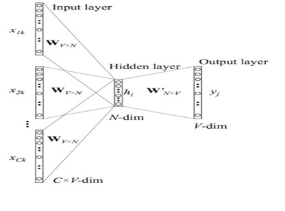
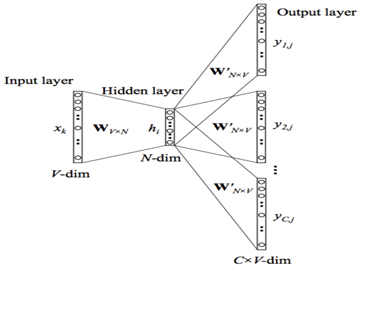
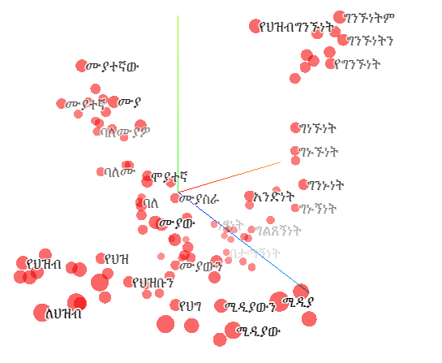
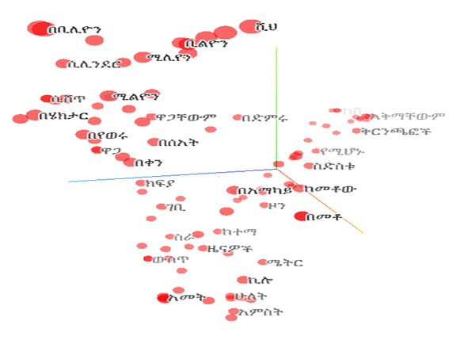

# Amharic Word Embedding

This repository is aimed to create pre-trained word vector for one of under-resourced Ethiopian language name Amharic using FastText model.
## Neural Word Embedding

Word embeddings are one of the few currently successful applications of unsupervised learning. Their main benefit arguably is that they don't require expensive annotation, but can be derived from large unannotated corpora that are readily available. 

### Word2Vec

Word2Vec is the name given to a class of neural network models with two layer that, given an unlabeled training corpus, produce a vector for each word in the corpus that encodes its semantic information. Word2vec can utilize either of two model architectures to produce a distributed representation of words: continuous bag-of-words (CBOW) or continuous skip-gram. 
In the continuous bag-of-words architecture, the model predicts the current word from a window of surrounding context words. The order of context words does not influence prediction (bag-of-words assumption. 

In the continuous skip-gram architecture, the model uses the current word to predict the surrounding window of context words. 
The skip-gram architecture weighs nearby context words more heavily than more distant context words. CBOW is faster while skip-gram is slower but does a better job for infrequent words.  

The neurons in the hidden layer are all linear neurons. The input layer is set to have as many neurons as there are words in the vocabulary for training. The hidden layer size is set to the dimensionality of the resulting word vectors. The size of the output layer is same as the input layer. Thus, assuming that the vocabulary for learning word vectors consists of V words and N to be the dimension of word vectors, the input to hidden layer connections can be represented by matrix W of size V×N with each row representing a vocabulary word. In same way, the connections from hidden layer to output layer can be described by matrix W^' of size N×V. In this case, each column of W^'output matrix represents a word from the given vocabulary. 

The one-hot encoded input vectors are connected to the hidden layer via a weight matrix and the hidden layer is connected to the output layer via a weight matrix. The weights between the input layer and the output layer can be represented by a V × N matrix W. Each row of W is the N-dimension vector representation V_w of the associated word of the input layer. That is hidden layer of the network. The word vectors W and W^' are learned via backpropagation and stochastic gradient descent. Finally, the output layer is output word in the training example which is also one-hot encoded. 

#### Continuous Bag-of-Word Model (CBOW)

While a language model is only able to look at the past words for its predictions, as it is evaluated on its ability to predict each next word in the corpus, a model that just aims to generate accurate word embeddings does not suffer from this restriction. 

In Word2Vec framework, every word W in the dictionary V is mapped to a vector w(x), which is a column in the matrix W (matrix W is randomly initialized). The CBOW model predicts a word w(x) using its context w(x - n),⋯, w(x - 1), w(x + 1),⋯, w(x + n). CBOW depicted at figure below is implemented in the following steps.

Step 1: Generate one hot vectors for the input context of size C.
For each alphabetically sorted unique vocabulary terms as target word, we create one hot vector of size C. i.e., for a given context word, only one out of V units,{x_1⋯x_v } will be 1, and all other units are 0.

Step 2: Compute the output of the hidden layer.

Hidden layer is based one hot encoded input layer. When computing the hidden layer output, instead of directly copying the input vector of the input context word, the CBOW model takes the average of the vectors of the input context words, and use the product of the input→hidden weight matrix W and the average vector as the output. 

Step 3: Compute the inputs to each node in the output layer

Next we compute score of each input vectors of output layer and finally we compute the output of the output layer. 
 
Step 4: Compute probability distribution of target word.



#### Skip-gram Model

Instead of using the surrounding words to predict the center word as with CBOW, skip-gram uses the center word to predict the surrounding words as can be seen as opposite of CBOW model. The input of the skip-gram model is a single target word and the output is the words in w_I's context {w_o,1,⋯w_o,C} defined by a word window of size. 
 
From the model depicted below, x represents the one-hot encoded vector corresponding to the input word in the training instance and {y_1,⋯y_C } are the one-hot encoded vectors corresponding to the output words in the training instance. 

The V x N matrix W is the weight matrix between the input layer and hidden layer whose ith row represents the weights corresponding to the ith word in the vocabulary. This weight matrix W is what we are interested in learning because it contains the vector encodings of all of the words in our vocabulary (as its rows). 

Each output word vector also has an associated N x V output matrix W'. There is also a hidden layer consisting of N nodes (the exact size of N is a training parameter). We know that the input to a unit in the hidden layer h_iis simply the weighted sum of its inputs. Since the input vector X is one-hot encoded, the weights coming from the nonzero element will be the only ones contributing to the hidden layer.                                                        	
In the same way, the inputs to each C x V of the output nodes is computed by the weighted sum of its inputs.                                                                          
However we can observe that the output layers for each output word share the same weights therefore u_(c_j )=u_j. We can finally compute the output of the jth node of the cth output word via the Softmax function which produces a multinomial distribution.
                        
In simple term, this value is the probability that the output of the jth node of the cth output word is equal to the actual value of the jth index of the cth output vector (which is one-hot encoded).


### FastText 

Motivated by, Google’s word2vec embeddings, in 2016 Facebook released an embedding model that recently attracted a great deal from the machine learning community especially for morphologically rich languages called FastText. 

The main goal of the FastText embeddings is to take into account the internal structure of words while learning word representations; this is especially useful for morphologically rich languages like Amharic, where otherwise the representations for different morphological forms of words would be learnt independently. The limitation becomes even more important when these words occur rarely unless we use external language dependent tools such as morphological analyzers. The semantic and syntactic information of words that is contained in these vectors make them powerful features for NLP tasks. 
One issue FastText criticized is its memory consumption to construct character n-gram level, it takes longer to generate FastText embeddings compared to word2vec model. 

However, word2vec and GloVe treats each word in corpus like an atomic entity and generates a vector for each word. For example, the word ዘገባ, ለዘገባ, በዘገባ, ስለዘገባ, etc are treated as atomic unless we apply morphology analysis before providing dataset to model. For morphologically rich languages such as Turkic, Arabic, Chinese, Amharic, etc. treating each varieties of words as atomic unit not effective approach.  

In contrast, FastText treats each word as composed of character n-grams. So the vector for a word is made of the sum of this character n grams. For example, the word vector “ዘገባ” is a sum of the vectors of the n-grams “<ዘገ”, “ዘገባ”,” ገባ”>. With this manifest it benefits to generate better word embeddings for rare words. Moreover, FastText predict vector for out of vocabulary words from its character n-grams even if word doesn't appear in training corpus. In contrast both Word2vec and Glove leave unseen words as out-of-vocabulary words.

As it is extension to Word2Vec model, FastText also has two architectures for computing word representations called Skip-gram and CBOW (continuous-bag-of-words). The Skip-gram model learns to predict a target word given a nearby word. On the other hand, the CBOW model predicts the target word according to its context. For instance, given the sentence “የህዝብ ግንኙነት ለህዝብ መረጃ በመስጠት የህዝብን አዝማሚያዎችና ተግባራት ለማስተካከል የሚከሄድ የማሳመን ሥራ ነዉ” and the target word “ተግባራት”. The Skip-gram model predicts the target using a random close-by word, like “አዝማሚያዎችና” or “የማሳመን”. Whereas the CBOW model takes all the words in a surrounding window, like {የህዝብን: አዝማሚያዎችና, ለማስተካከል: የሚከሄድ}, and uses the sum of their vectors to predict the target word “ተግባራት”. 

At the time of training, FastText trains by sliding a window over the input text and either learning the target word from the remaining context (CBOW), or all the context words from the target word (“Skip-gram”), and learning can be viewed as a series of updates to a neural network with two layers of weights and three tiers of neurons, in which the outer layer has one neuron for each word in the vocabulary and the hidden layer has as many neurons as there are dimensions in the embedding space. In this way, it is similar to Word2Vec. Unlike word2vec, FastText also learn vectors for sub-parts of words called character n-grams ensuring that e.g., the words “የህዝብን”, “የህዝብ”,” ህዝብ” and “ህዝብን” all fall into same dimension in vector space, even if they tend to appear in different contexts. This feature enhances learning on heavily inflected languages.  Despite use of sub-word information, training FastText is same as Word2Vec for both CBOW and Skip-gram models.

The key difference between FastText and Word2Vec is the use of n-grams. Word2Vec learns vectors only for complete words found in the training corpus. FastText, on the other hand, learns vectors for the n-grams that are found within each word, as well as each complete word. 
At each training step in FastText, the mean of the target word vector and its component n-gram vectors are used for training. The adjustment that is calculated from the error is then used uniformly to update each of the vectors that were combined to form the target. This adds a lot of additional computation to the training step. 
At each point, a word needs to sum and average its n-gram component parts. The trade-off is a set of word-vectors that contain embedded sub-word information. These vectors have been shown to be more accurate than Word2Vec vectors by a number of different measures. 
Treating character n-gram manifests FastText the following advantage over Word2Vec: 
* Generate better word embeddings for rare words (even if words are rare their character n grams are still shared with other words - hence the embeddings can still be good). This is simply because, in word2vec a rare word (e.g., 10 occurrences) has fewer neighbors to be pulled by, in comparison to a word that occurs 100 times whereas FastText has more neighbor context words and hence is pulled more often resulting in better word vectors.
* Out of vocabulary words - they can construct the vector for a word from its character n grams even if word doesn't appear in training corpus. Both Word2vec and Glove can't. 

It is not clear to use which embedding in what situation, but based on comparative study done by, FastText built on the top of Word2Vec do significantly better on morphology dependent tasks. 
In contrast, word2vec model seems to perform better on semantic tasks, since words in semantic analogies are unrelated to their char n-grams, and the added information from irrelevant char n-grams worsens the embeddings. 
But, in all task FastText significantly outperformed Word2vec models for morphologically rich languages. 


### Expermentation for Amharic FastText Vectors
I Expermented FastText for Amharic word vectors using [Gensim](https://pypi.org/project/gensim/) Library.

To make the dataset balaced, I have considered social, sport, political, business and news domains in addition to  bible, blogs, and local documents such as Amharic books. All web data is copied using HTTRACK Website Copier. 
Python based [BeautifulSoup](https://pypi.python.org/pypi/beautifulsoup4)  library is used to extract text content from web files crawled. Then after applying simple preprocessing steps such as tokenization and normalization I have trained FastText model using iterative data passing approach.

<table border='1'>
	<caption>Corpus description</caption>
	<tr><th>Total Document</th><th>No. of Tokens</th><th>No. of Unique Words</th></tr>
	<tr><td>32,941</td><td>40,816,929</td><td>275,829</td></tr>
</table>

Hyper parameter	Value
* Window	5,10
* Embedding dimension	100 ,300
* Learning rate	0.05
* Workers	30
* Negative Sampling	10,15
* Iteration 	10
* N-gram size	3,6

```python
import logging
import os
from gensim.models.fasttext import FastText

from gensim.models import KeyedVectors
EMBEDDING_DIR=''
PREPROCESSED_DIR=''
class WordEmbeddingConfig(object):
    """Word2Vec Training parameters"""
    window=5 #Maximum skip length window between words
    emb_dim=300 # Set size of word vectors
    emb_lr=0.05 #learning rate for SGD estimation.
    nepoach=20 #number of training epochs
    nthread=100 #number of training threads
    sample = 0 #Set threshold for occurrence of words. Those that appear with higher frequency in the training data will be randomly down-sampled
    negative = 15 #negative sampling is used with defined negative example
    hs = 0 #0 Use Hierarchical Softmax; default is 0 (not used)
    binary=0 # 0 means not saved as .bin. Change to 1 if allowed to binary format
    sg=1 # 0 means CBOW model is used. Change to 1 to use Skip-gram model
    iterate=10 # Run more training iterations
    minFreq=2 #This will discard words that appear less than minFreq times 
    WORD_VECTOR_CACHE=EMBEDDING_DIR+'am_word_vectors_sts.npy'
    if sg==0:
        model_name='am_fasttext_cbow_'+str(emb_dim)+'D'
    elif sg==1:
         model_name='am_fasttext_sg_'+str(emb_dim)+'D'
         
class corpus_sentences(object):# accept sentence stored one per line in list of files inside defined directory
    def __init__(self, dirname):
        self.dirname = dirname
 
    def __iter__(self):
        for answer in data:
            words=nltk.word_tokenize(answer)
            yield words

logging.basicConfig(format='%(asctime)s : %(levelname)s : %(message)s', level=logging.DEBUG)


def load_am_word_vectors():
    if WordEmbeddingConfig.sg==0:
            model_type='CBOW'
    else:
        model_type='Skip-gram'        
    if os.path.exists(WordEmbeddingConfig.model_name):
        print('Loading Word2Vec Amharic Pretrained '+model_type+' model with '+str(WordEmbeddingConfig.emb_dim)+' dimension\n') 
        am_model= KeyedVectors.load(TrainConfig.model_name)
    else:
        print('Loading Sentences with memory freindly iterator ...\n')
        sentences = corpus_sentences(PREPROCESSED_DIR) # a memory-friendly iterator        
        print('Training FastText '+model_type+' with '+str(WordEmbeddingConfig.emb_dim)+' dimension\n') 
        am_model = FastText(size=WordEmbeddingConfig.emb_dim, window=WordEmbeddingConfig.window, 
                            min_count=WordEmbeddingConfig.minFreq, workers=WordEmbeddingConfig.nthread,sg=WordEmbeddingConfig.sg,
                            iter=WordEmbeddingConfig.iterate,negative=WordEmbeddingConfig.negative,
                            hs=WordEmbeddingConfig.hs)
        am_model.build_vocab(sentences)

        am_model.train(sentences, total_examples=am_model.corpus_count, epochs=am_model.iter)
        #trim unneeded model memory = use (much) less RAM
        am_model.init_sims(replace=True)
        
        #Saving model    
        model_name=DirConfig.EMBEDDING_DIR+WordEmbeddingConfig.model_name
        am_model.save(model_name)        
        
    return am_model    
am_model=load_am_word_vectors()        
````




From the above figure we can visualize that our domain trained FastText model is capable of clustering syntactically related word to their semantic space. Moreover, it detected word with spelling error ‘የህዝ’ to say ‘የህዝብ’. It interesting feature of our FastText model is its ability to cluster words with different morphological varietiy, but same in meaning. It also shows different mophological variants of Amharic word is clustered to one their semaintically related words.  



Another interesting feature is its capacity to cluster words on their semantic category. From the above Figure My FastText model categorized Amharic words such ወር, ቀን, ሰዓት to one category using as time measurement. As we can also see that ሜትር and ኪሎ are clustered together. It clusters large number ሚሊየን, ቢሊዮን, ትሪሊዮን, and ሺህ to one; በአማካይ and በመቶ; ክፍያ, ወጪ and ገቢ at one category. Because of space limit we visualized only sample ones. This shows that My word vectors are semantically and syntactically rich and can help NLP applications to get meaning of words using this embeddings.
# References
T. Mikolov, I. Sutskever, K. Chen, S. Corrado, J. Dean, “Distributed Representations Of Words And Phrases And Their Compositionality”, in Advances in Neural Information Processing Systems, pp. 3111–3119, 2013.
Z. Yang, D. Yang, C. Dyer, X. He, A. Smola, E. Hovy, “Hierarchical Attention Networks for Document Classification” In HLT-NAACL, pp. 1480-1489, 2016.
