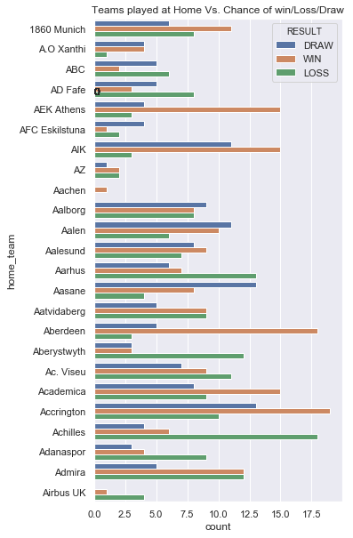
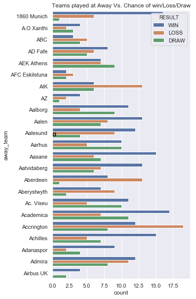
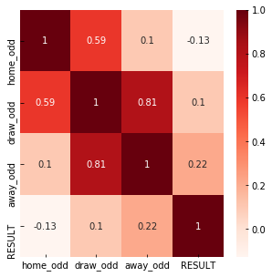
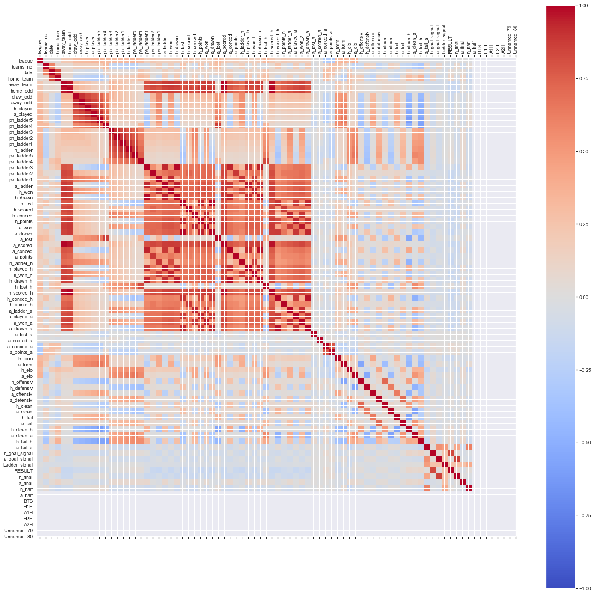
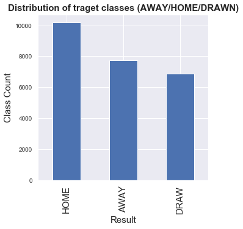

### EDA for football league dataset

**** This project is EDA that I have submitted for 10 academy data science felowship pre-interview examination. However, it has some modification from original submission***

A football game generates many events and it is very important and interesting to take into account the context in which those events were generated. This dataset should keep sports analytics enthusiasts awake for long hours as the number of questions that can be asked is huge.

Read [these blogs](http://crabstats.blogspot.com/>) to get a good understanding of soccer/football stats.

**Data description:** 

Nearly 25,000 soccer games from all leagues all over the world. The fields in the data set are: Columns A to E contains information about the league, home and away teams, date etc Columns F, G and H contain the odds for the home win, draw and away win Columns I to BQ contain the team statistics. 

Home team stats are prefixed with a "h" similarly, away team stats are prefixed with an "a". Examples include ladder position (which is a term for a rank in a group - [here](https://www.flashscore.com.au/football/europe/euro/standings) an example), games played, goals conceded, away games won etc. Columns BR to CA contain final result information. That is the result, the full time result and if available, the half time score as well.

For each game there is: 
1. Statistics on the two teams, such as ladder position, win-loss history, games played 
2. Odds for home win, draw, away win (some-times is zero if odds not available) 
3. The result for that game (including the half time result if available

The dataset ranges from January 2016 to October 2017 and the statistics have been sourced from a few different websites. Odds come from BET365 and the results have been manually entered from [http://www.soccerstats.com](http://www.soccerstats.com)

Get more insight about the columns in the data by hovering your mouse in front of the names [here](https://www.soccerstats.com/latest.asp?league=germany3)

**Data Location:** 
- https://www.kaggle.com/frankpac/soccerdata
### Objectives:

**Exploratory analysis:**
- Understand which leagues & teams are represented in this data set - use histograms, pandas groupbys to get ideas on this 
- Explain if playing at home have a higher chance of winning? What about draws and loses?
- Explain how are predicted odds correlated to final results? 
- How many teams played more than 10 games (at home or away)?
- How are the home or away statistics distributed? Is there an imbalance in the data set?
- Visualizing data set, make histograms, line (trend) plots to understand the nature of the data


```python
## required packages
import pandas as pd 
import numpy as np
import matplotlib.pyplot as plt 
import seaborn as sns 
```


```python
class SoccerDataset(object):
    def __init__(self):
        self.DATA_DIR='data/SoccerData.xlsx'
        self.sheet='All Data'
        self.data=self.load_data()
    #load data
    def load_data(self):
        data = pd.read_excel(self.DATA_DIR, self.sheet, index_col=None)#reading data in particular sheet 'All Data'
        return data
    
    ##get list of column names
    def getColumns(self):
        return self.data.columns
    
    ##shows non null value caount and data type per column 
    def getDataInfo(self):
        return self.data.info()
```


```python
#Loading Data
SoccerDataset=SoccerDataset()
data=SoccerDataset.data
```


```python
## get columns
SoccerDataset.getColumns()
```


    Index(['league', 'teams_no', 'date', 'home_team', 'away_team', 'home_odd',
           'draw_odd', 'away_odd', 'h_played', 'a_played', 'ph_ladder5',
           'ph_ladder4', 'ph_ladder3', 'ph_ladder2', 'ph_ladder1', 'h_ladder',
           'pa_ladder5', 'pa_ladder4', 'pa_ladder3', 'pa_ladder2', 'pa_ladder1',
           'a_ladder', 'h_won', 'h_drawn', 'h_lost', 'h_scored', 'h_conced',
           'h_points', 'a_won', 'a_drawn', 'a_lost', 'a_scored', 'a_conced',
           'a_points', 'h_ladder_h', 'h_played_h', 'h_won_h', 'h_drawn_h',
           'h_lost_h', 'h_scored_h', 'h_conced_h', 'h_points_h', 'a_ladder_a',
           'a_played_a', 'a_won_a', 'a_drawn_a', 'a_lost_a', 'a_scored_a',
           'a_conced_a', 'a_points_a', 'h_form', 'a_form', 'h_elo', 'a_elo',
           'h_offensiv', 'h_defensiv', 'a_offensiv', 'a_defensiv', 'h_clean',
           'a_clean', 'h_fail', 'a_fail', 'h_clean_h', 'a_clean_a', 'h_fail_h',
           'a_fail_a', 'h_goal_signal', 'a_goal_signal', 'Ladder_signal', 'RESULT',
           'h_final', 'a_final', 'h_half', 'a_half', 'BTS', 'H1H', 'A1H', 'H2H',
           'A2H', 'Unnamed: 79', 'Unnamed: 80'],
          dtype='object')


```python
fig, ax = plt.subplots(figsize=(15, 5))
data.groupby('league').count()[['home_team']].plot.bar(
                      ax=ax,
                      title="Frequency distribution of Leagues over teams")
plt.show()
```


```python
## get info about data
SoccerDataset.getDataInfo()
```

    <class 'pandas.core.frame.DataFrame'>
    RangeIndex: 24830 entries, 0 to 24829
    Data columns (total 81 columns):
    league           24830 non-null int8
    teams_no         24830 non-null int64
    date             24830 non-null int16
    home_team        24830 non-null int16
    away_team        24830 non-null int16
    home_odd         24830 non-null float64
    draw_odd         24830 non-null float64
    away_odd         24830 non-null float64
    h_played         24830 non-null int64
    a_played         24830 non-null int64
    ph_ladder5       24830 non-null int64
    ph_ladder4       24830 non-null int64
    ph_ladder3       24830 non-null int64
    ph_ladder2       24830 non-null int64
    ph_ladder1       24830 non-null int64
    h_ladder         24830 non-null int64
    pa_ladder5       24830 non-null int64
    pa_ladder4       24830 non-null int64
    pa_ladder3       24830 non-null int64
    pa_ladder2       24830 non-null int64
    pa_ladder1       24830 non-null int64
    a_ladder         24830 non-null int64
    h_won            24830 non-null int64
    h_drawn          24830 non-null int64
    h_lost           24830 non-null int64
    h_scored         24830 non-null int64
    h_conced         24830 non-null int64
    h_points         24830 non-null int64
    a_won            24830 non-null int64
    a_drawn          24830 non-null int64
    a_lost           24830 non-null int64
    a_scored         24830 non-null int64
    a_conced         24830 non-null int64
    a_points         24830 non-null int64
    h_ladder_h       24830 non-null int64
    h_played_h       24830 non-null int64
    h_won_h          24830 non-null int64
    h_drawn_h        24830 non-null int64
    h_lost_h         24830 non-null int64
    h_scored_h       24830 non-null int64
    h_conced_h       24830 non-null int64
    h_points_h       24830 non-null int64
    a_ladder_a       24830 non-null int64
    a_played_a       24830 non-null int64
    a_won_a          24830 non-null int64
    a_drawn_a        24830 non-null int64
    a_lost_a         24830 non-null int64
    a_scored_a       24830 non-null int64
    a_conced_a       24830 non-null int64
    a_points_a       24830 non-null int64
    h_form           24830 non-null int64
    a_form           24830 non-null int64
    h_elo            24830 non-null int64
    a_elo            24830 non-null int64
    h_offensiv       24830 non-null int64
    h_defensiv       24830 non-null int64
    a_offensiv       24830 non-null int64
    a_defensiv       24830 non-null int64
    h_clean          24830 non-null float64
    a_clean          24830 non-null float64
    h_fail           24830 non-null float64
    a_fail           24830 non-null float64
    h_clean_h        24830 non-null float64
    a_clean_a        24830 non-null float64
    h_fail_h         24830 non-null float64
    a_fail_a         24830 non-null float64
    h_goal_signal    23823 non-null float64
    a_goal_signal    23834 non-null float64
    Ladder_signal    24830 non-null int64
    RESULT           24830 non-null int64
    h_final          24830 non-null object
    a_final          24820 non-null float64
    h_half           15729 non-null float64
    a_half           15729 non-null float64
    BTS              24830 non-null int64
    H1H              17365 non-null float64
    A1H              17365 non-null float64
    H2H              17365 non-null float64
    A2H              17365 non-null float64
    Unnamed: 79      262 non-null object
    Unnamed: 80      262 non-null object
    dtypes: float64(20), int16(3), int64(54), int8(1), object(3)
    memory usage: 14.8+ MB
    
As we can see from the above cell result, we have 7 categorical, 1 date and 73 numerical features. It seams that most of data features has equal non-null values. However, the last two unnamed features has more than 98% null value and it seems they are annotation column than real value. So, I will fix it at data cleaning step later. Moreover, we need to work on also feature reduction through insights from analysis by focusing on only informative features. Next, lets inspect distribution of each features and their interaction.

```python
## to check distribution of each categorical features we should define data type to appropriate value.
##Here I am casting data type of all categorical features to int16 except RESULT column.
## Because later, I will replace the values of target column to fixed number to indicate WIN, LOSS and DRAW
data['league'] =data['league'].astype('category').cat.codes
data['home_team'] =data['home_team'].astype('category').cat.codes
data['away_team'] =data['away_team'].astype('category').cat.codes
data['date'] =data['date'].astype('category').cat.codes
```


```python
## lets split data based on result feature to explore probability of winning if home or away team

data['RESULT'] = data['RESULT'].replace(['HOME'], 'WIN')#win
data['RESULT'] = data['RESULT'].replace(['AWAY'], 'LOSS')#loss
data['RESULT'] = data['RESULT'].replace(['DRAW'], 'DRAW')#draw

data['RESULT'].head()
```


    0    DRAW
    1    DRAW
    2     WIN
    3    DRAW
    4     WIN
    Name: RESULT, dtype: object


```python
## lets split data based on result feature to explore probability of winning if home or away team
# score_data_home = data[data['RESULT'] == 'HOME'] ##only home 
data['RESULT'] = data['RESULT'].replace(['HOME'], 'LOSS')
data['RESULT'] = data['RESULT'].replace(['AWAY'], 'WIN')
data['RESULT'] = data['RESULT'].replace(['DRAW'], 'DRAW')
data['RESULT'].head()
```


    0    DRAW
    1    DRAW
    2    LOSS
    3    DRAW
    4    LOSS
    Name: RESULT, dtype: object


<b>Relationship of playing at Home or Away with Result</b>


```python
# data=data.loc[data['RESULT'] == 'HOME']
sns.set(rc={'figure.figsize':(10,300)})
ax=sns.countplot(y='home_team',hue='RESULT',data=data)
for p in ax.patches:
    patch_height = p.get_height()
    if np.isnan(patch_height):
        patch_height = 0
    ax.annotate('{}'.format(int(patch_height)), (p.get_x()+0.01, patch_height+3))
plt.title("Teams played at Home Vs. Chance of win/Loss/Draw")
plt.show()
```
Only sample for look. The first 500 teams



From the above plot, we can see that playing at home (one with orange color) has great chance to win than playing away(one with green color).

```python
sns.set(rc={'figure.figsize':(10,300)})
ax=sns.countplot(y='away_team',hue='RESULT',data=data)
for p in ax.patches:
    patch_height = p.get_height()
    if np.isnan(patch_height):
        patch_height = 0
    ax.annotate('{}'.format(int(patch_height)), (p.get_x()+0.05, patch_height+10))
plt.title("Teams played at Away Vs. Chance of win/Loss/Draw")
plt.show()
```
Only sample for look. The first 500 teams



The same result is shown for away also. Most of the teams has better chance to win at home than away.

```python
_=data.hist(figsize=(16, 20), bins=50, xlabelsize=8, ylabelsize=8)
```


As we can see from the above distribution plot, most of features in the same group has same distribution. For example pa_ladder 1,2,3,4,5 with ph_ladder 1,2,3,4,5. So,we can merge the features.


```python
#Using Pearson Correlation
plt.figure(figsize=(5,5))
cor=data[['home_odd','draw_odd','away_odd','RESULT']].corr()
sns.heatmap(cor, annot=True, cmap=plt.cm.Reds)
plt.show()
```





```python
#Lets explore more about corelation with other final result values
#Using Pearson Correlation
plt.figure(figsize=(10,10))
cor=data[['home_odd','draw_odd','away_odd','RESULT']].corr()
sns.heatmap(cor, annot=True, cmap=plt.cm.Reds)
plt.show()
```


```python
#Teams played more than 10 games
played_teams_count = data['home_team'].value_counts()
no_game_played=[]
most_played_teams=[]
for i,team in zip(played_teams_count.index,played_teams_count.values):
    if team>10:
            no_game_played.append(team)
            most_played_teams.append(i)
soccer_data=pd.DataFrame({'Team':most_played_teams,'GameCount':no_game_played})
soccer_data.tail(20) ##to check it only includes game count greater than 10. N:B: the data is decendingly sorted.
```


<div>
<style scoped>
    .dataframe tbody tr th:only-of-type {
        vertical-align: middle;
    }

    .dataframe tbody tr th {
        vertical-align: top;
    }

    .dataframe thead th {
        text-align: right;
    }
</style>
<table border="1" class="dataframe">
  <thead>
    <tr style="text-align: right;">
      <th></th>
      <th>Team</th>
      <th>GameCount</th>
    </tr>
  </thead>
  <tbody>
    <tr>
      <th>856</th>
      <td>Betis</td>
      <td>12</td>
    </tr>
    <tr>
      <th>857</th>
      <td>Como</td>
      <td>12</td>
    </tr>
    <tr>
      <th>858</th>
      <td>Zweigen K</td>
      <td>12</td>
    </tr>
    <tr>
      <th>859</th>
      <td>Ponferradina</td>
      <td>12</td>
    </tr>
    <tr>
      <th>860</th>
      <td>Roasso K</td>
      <td>12</td>
    </tr>
    <tr>
      <th>861</th>
      <td>Zwiegen K</td>
      <td>12</td>
    </tr>
    <tr>
      <th>862</th>
      <td>Mafra</td>
      <td>12</td>
    </tr>
    <tr>
      <th>863</th>
      <td>Airbus UK</td>
      <td>12</td>
    </tr>
    <tr>
      <th>864</th>
      <td>Daegu</td>
      <td>11</td>
    </tr>
    <tr>
      <th>865</th>
      <td>Juventude RS</td>
      <td>11</td>
    </tr>
    <tr>
      <th>866</th>
      <td>Modena</td>
      <td>11</td>
    </tr>
    <tr>
      <th>867</th>
      <td>Rangers</td>
      <td>11</td>
    </tr>
    <tr>
      <th>868</th>
      <td>Atletico CP</td>
      <td>11</td>
    </tr>
    <tr>
      <th>869</th>
      <td>Presov</td>
      <td>11</td>
    </tr>
    <tr>
      <th>870</th>
      <td>Norrby</td>
      <td>11</td>
    </tr>
    <tr>
      <th>871</th>
      <td>Osters IF</td>
      <td>11</td>
    </tr>
    <tr>
      <th>872</th>
      <td>Hradec Kralove</td>
      <td>11</td>
    </tr>
    <tr>
      <th>873</th>
      <td>Tianjin Quanjian</td>
      <td>11</td>
    </tr>
    <tr>
      <th>874</th>
      <td>Brommapojkarna</td>
      <td>11</td>
    </tr>
    <tr>
      <th>875</th>
      <td>CSMS Iasi</td>
      <td>11</td>
    </tr>
  </tbody>
</table>
</div>


```python
import numpy as np
corr = data.corr()
fig = plt.figure(figsize=(25,25))
ax = fig.add_subplot(111)
cax = ax.matshow(corr,cmap='coolwarm', vmin=-1, vmax=1)
fig.colorbar(cax)
ticks = np.arange(0,len(data.columns),1)
ax.set_xticks(ticks)
plt.xticks(rotation=90)
ax.set_yticks(ticks)
ax.set_xticklabels(data.columns)
ax.set_yticklabels(data.columns)
plt.show()
```





From the above correlation matrix when there is no correlation between 2 variables (when correlation is 0 or near 0) the color is gray. The darkest red means there is a perfect positive correlation, while the darkest blue means there is a perfect negative correlation. The matrix gives as interesting focus to drop or retain features and which features has great impact. But before decision we should resample the data to minimize influence of outliers.


```python
target_count = data.RESULT.value_counts()
print('AWAY:', target_count[0])
print('HOME:', target_count[1])
print('DRWAN:', target_count[2])
fig, ax = plt.subplots(figsize=(5, 5))
ax.tick_params(axis='x', labelsize=15)
ax.tick_params(axis='y', labelsize=10)
ax.set_xlabel('Result', fontsize=15)
ax.set_ylabel('Class Count' , fontsize=15)
ax.set_title('Distribution of traget classes (AWAY/HOME/DRAWN)', fontsize=15, fontweight='bold')
_=target_count.plot(ax=ax, kind='bar')
```

    AWAY: 10194
    HOME: 7756
    DRWAN: 6880
    





```python
##As we can see from the result, data distribution for AWAY, HOME and DROWN is relatively unballanced so I have to consider 
## ballancing mechanisims appropriate to the problem. Lets use ... approach because of 
```
