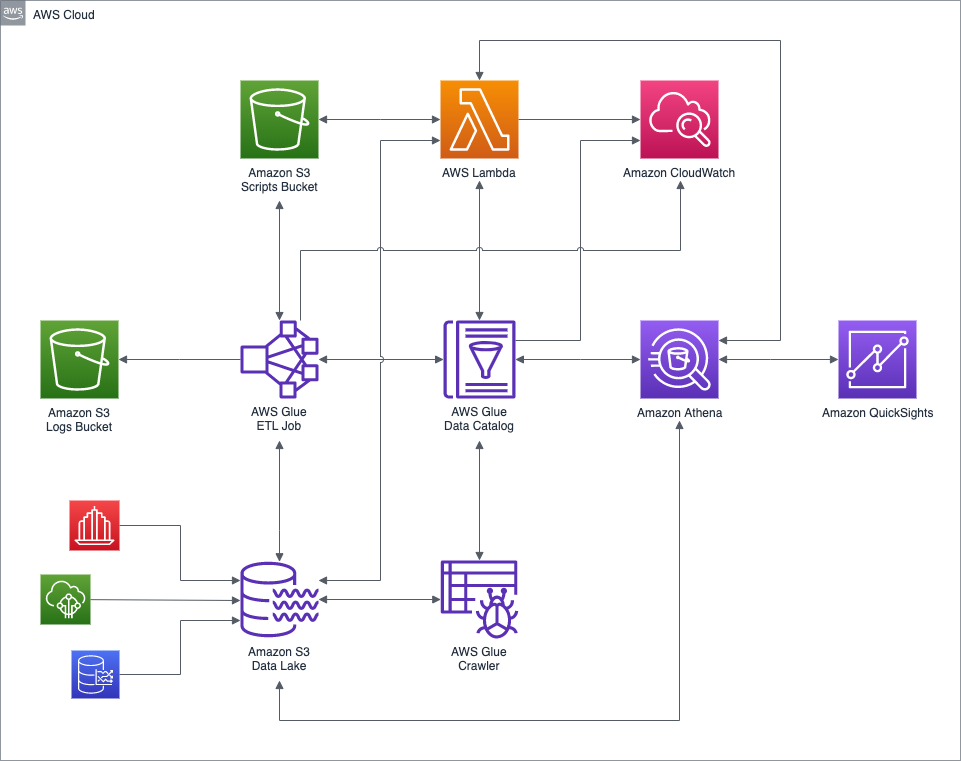
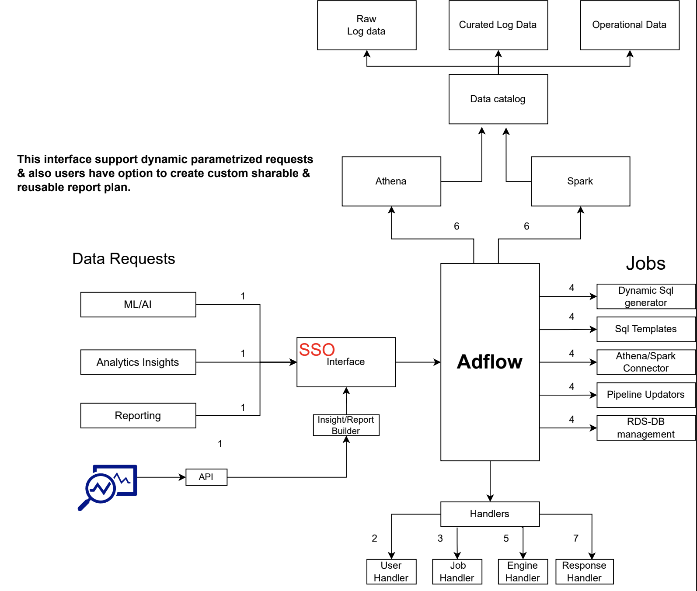

# Building an Advanced Data Pipeline

## Introduction

In today's data-driven world, organizations need efficient and scalable data processing pipelines. Adflow is a powerful data platform designed team in Adludio to meet this demand by providing a robust and flexible infrastructure for handling large-scale data processing tasks. In this article, we will explore the technical components of Adflow, focusing on its tech stack, the data interface, and the steps required to set up a similar ELT pipeline.

## Adflow Tech Stack Overview

The Adflow platform leverages a combination of industry-leading technologies to ensure high performance, scalability, and ease of use. Below is a breakdown of the key technologies integrated into the Adflow tech stack:


- **Apache Spark**: A powerful distributed data processing engine that handles large-scale data processing tasks across clusters.
- **AWS Athena**: An interactive query service that allows you to analyze data in Amazon S3 using standard SQL.
- **Apache Hive**: A data warehouse software that facilitates reading, writing, and managing large datasets residing in distributed storage.
- **Presto**: A distributed SQL query engine designed for fast analytics on large datasets.
- **Parquet**: A columnar storage file format optimized for use with big data processing frameworks.

## Setting Up and Implementing the Adflow Tech Stack

### 1. Apache Spark

**Setup and Installation:**

Apache Spark is central to Adflow’s ability to process large datasets efficiently. It’s particularly useful for running complex transformations on auction-level impression data from ad servers.

- **Install Spark** on a cluster using Amazon EMR:

  ```bash
  aws emr create-cluster --name "Adflow Spark Cluster" \
  --release-label emr-6.3.0 \
  --applications Name=Spark \
  --ec2-attributes KeyName=myKey \
  --instance-type m5.xlarge \
  --instance-count 3
  ```

**Implementation:**

- **Data Processing**: Spark is used to ingest and process data in parallel. For example, you might aggregate impressions data per ad ID and store the results back into S3:

  ```python
  from pyspark.sql import SparkSession

  spark = SparkSession.builder.appName("Adflow").getOrCreate()

  df = spark.read.format("parquet").load("s3://auction-data/impressions/")
  processed_df = df.groupBy("ad_id").agg({"impressions": "sum"})
  processed_df.write.format("parquet").save("s3://processed-data/impressions/")
  ```

### 2. AWS Athena

**Setup and Installation:**

AWS Athena is used in Adflow for querying data stored in S3 using standard SQL. It doesn't require any installation but needs proper configuration:

- **Set up a Glue Data Catalog** to manage metadata for the datasets that Athena will query:

  ```bash
  aws glue create-database --database-input '{"Name": "adflow_data_catalog"}'
  ```

**Implementation:**

- **Querying Processed Data**: After Spark processes the data, Athena can be used to run complex queries:

  ```sql
  SELECT ad_id, SUM(impressions) 
  FROM processed_data.impressions 
  GROUP BY ad_id;
  ```

### 3. Apache Hive

**Setup and Installation:**

Apache Hive is used for managing large datasets that are stored in a distributed environment. Hive provides a SQL-like interface to query these datasets.

- **Set up Hive** on the same EMR cluster as Spark:

  ```bash
  aws emr add-steps --cluster-id <cluster-id> --steps Type=Hive,Name="Setup Hive",ActionOnFailure=CONTINUE,Args=["-f","s3://my-bucket/setup-hive-script.q"]
  ```

**Implementation:**

- **Data Warehousing**: Use Hive to store processed data in a structured format that can be queried for detailed analysis:

  ```sql
  CREATE EXTERNAL TABLE processed_data (
      ad_id STRING,
      total_impressions BIGINT
  )
  ROW FORMAT DELIMITED
  FIELDS TERMINATED BY ','
  STORED AS TEXTFILE
  LOCATION 's3://processed-data/impressions/';
  ```

### 4. Presto

**Setup and Installation:**

Presto is another powerful query engine, which is designed for fast, interactive queries across large datasets. It is often used in conjunction with Hive or directly on S3 data.

- **Install and Configure Presto**:

  ```bash
  aws emr create-cluster --name "Adflow Presto Cluster" \
  --release-label emr-6.3.0 \
  --applications Name=Presto \
  --ec2-attributes KeyName=myKey \
  --instance-type m5.xlarge \
  --instance-count 3
  ```

**Implementation:**

- **Fast Analytics**: Presto can be used to run queries that need to return results in real-time, making it ideal for operational dashboards:

  ```sql
  SELECT ad_id, COUNT(impressions) AS impression_count
  FROM hive.processed_data.impressions
  WHERE event_time > NOW() - INTERVAL '1' DAY
  GROUP BY ad_id;
  ```

### 5. Parquet

**Setup and Installation:**

Parquet is a columnar storage format used by Adflow to optimize both the storage and processing of big data. It’s particularly useful for storing large datasets like auction-level impressions because it allows for efficient querying and retrieval.

- **Save Data in Parquet Format** using Spark:

  ```python
  processed_df.write.format("parquet").save("s3://processed-data/impressions/")
  ```

**Implementation:**

- **Optimized Storage**: By storing data in Parquet format, Adflow ensures that only the necessary columns are read during query execution, improving performance significantly.

## Understanding the Data Interface

Adflow's data interface is designed to support dynamic, parameterized requests. It provides users with the capability to create custom, shareable, and reusable report plans, ensuring flexibility and efficiency in data handling. Below is a visual representation of the overall data interface:



- **Data Catalog**: The central hub for organizing and managing metadata for datasets. It ensures easy discoverability and accessibility of data.
- **SSO Interface**: A Single Sign-On interface that integrates various data request types such as ML/AI, Analytics Insights, and Reporting into the platform.
- **Handlers**: These are responsible for managing jobs, user interactions, and responses, ensuring seamless operation and interaction within the platform.

## Setting Up an ELT Pipeline

To replicate the ELT pipeline functionality provided by Adflow, follow the steps below:

### Step 1: Setting Up AWS Glue for ETL

```python
import boto3

glue_client = boto3.client('glue')

response = glue_client.create_job(
    Name='etl-job',
    Role='AWSGlueServiceRole',
    Command={
        'Name': 'glueetl',
        'ScriptLocation': 's3://scripts-bucket/etl_script.py'
    },
    DefaultArguments={
        '--job-bookmark-option': 'job-bookmark-enable',
    },
    MaxRetries=3
)
```

### Step 2: Querying Data with AWS Athena

```sql
SELECT * 
FROM my_database.my_table
WHERE event_date >= '2024-01-01'
```

### Step 3: Processing Data with Apache Spark

```python
from pyspark.sql import SparkSession

spark = SparkSession.builder.appName("Adflow").getOrCreate()

df = spark.read.format("parquet").load("s3://my-bucket/data/")
df.filter(df["event_date"] >= "2024-01-01").show()
```

## Conclusion

By developing Adflow, we have created a cost-effective and easy-to-maintain ELT pipeline capable of tracking, ingesting, staging, and transforming big data, increasing on average by 15GB per month with more than 100 dimensions. This solution not only meets our data processing needs but also saves 90% in terms of cost compared to using third-party tools like Snowflake. The robust architecture and flexibility of Adflow make it a highly efficient alternative for handling large-scale data processing tasks.
