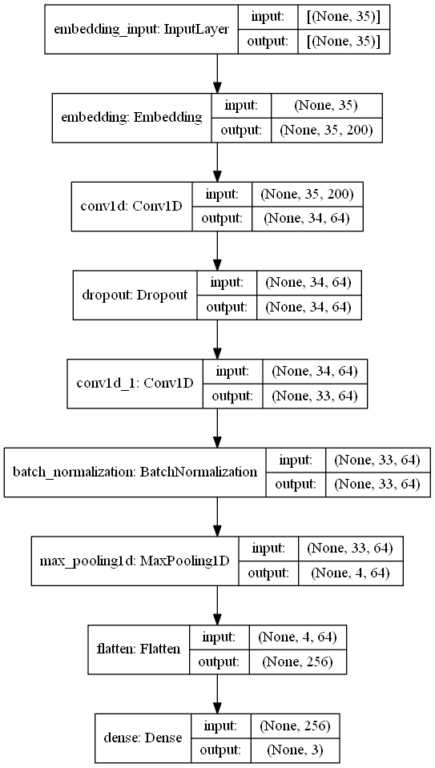
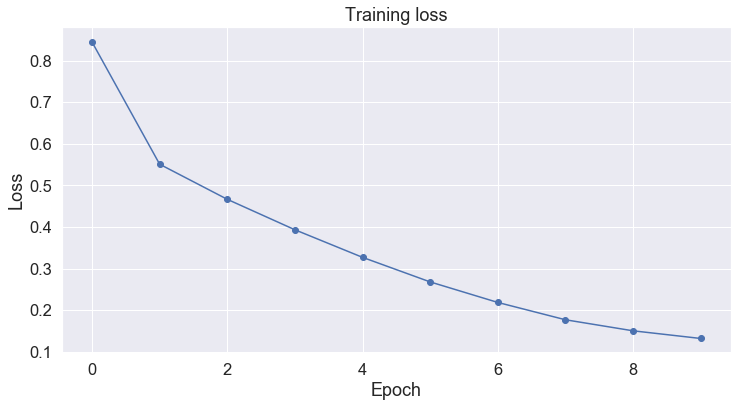
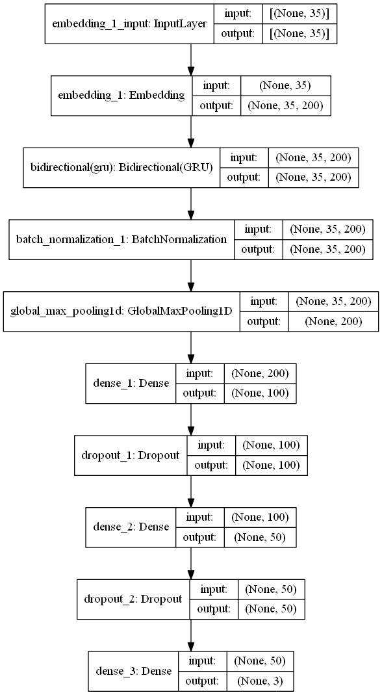
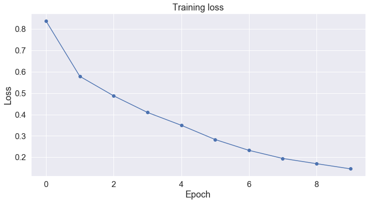
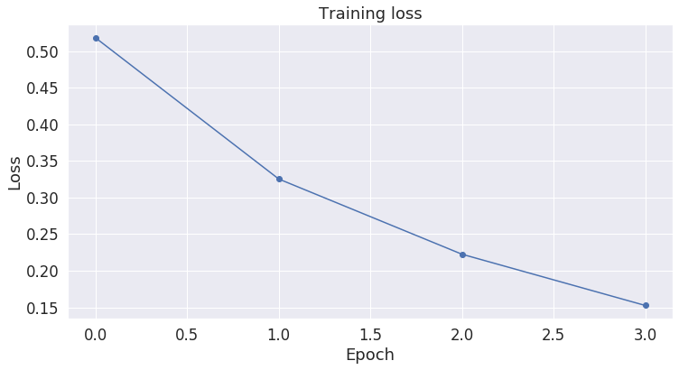

### Airlines Tweet Sentiment Classification: CNN, GRU, and BERT
Customer service satifaction is an important factor that a company can measure its success. As part of NLP, sentiment anlysis and opinion mining become popular research area that aims to categorize cause of posetive or negative comment or predict negativity and posetivity of comments through semantic comment analysis. The aim of this work is classifying whether the sentiment of the tweets for given airlines is positive, neutral, or negative using Machine Learning Techniques. Here I will show how to use text analytics with deep learning models such as CNN, RNN, and transformers such as BERT.


```python
import pandas as pd ## for reading and undestanding data
import matplotlib.pyplot as plt ## for plotting data
import seaborn as sns ## another library to visualize data features
import numpy as np ## for numerical array processing
import logging ## to handle logger
import re ## for Regular Expression: pattern detector
```


```python
## Logger configuration
def get_logger():
    FORMAT = '[%(levelname)s]%(asctime)s:%(name)s:%(message)s'
    logging.basicConfig(format=FORMAT)
    logger = logging.getLogger('main')
    logger.setLevel(logging.DEBUG)
    return logger
    
logger = get_logger()
```


```python
##reading data
tweet=pd.read_csv('twitter-airline/Tweets.csv')
```


```python
tweet.shape
```


    (14640, 15)


```python
tweet.columns ## to get name of features in the data
```


    Index(['tweet_id', 'airline_sentiment', 'airline_sentiment_confidence',
           'negativereason', 'negativereason_confidence', 'airline',
           'airline_sentiment_gold', 'name', 'negativereason_gold',
           'retweet_count', 'text', 'tweet_coord', 'tweet_created',
           'tweet_location', 'user_timezone'],
          dtype='object')


The data has 14640 samples with 15 features. However, I only use 'text' and 'airline_sentiment' feature as the aim of this project is to predict sentiment class given tweets.

Next lets apply some preprocessing in tweets
1. In practice we usually use shortened form of words in tweets than full expanded form. So, using common English short forms, I will expand it to full notation to minimize OOV(out-of-vocabulary) words
2. Removal of unnecessary punctuation marks
3. changing to lowercase
4. Dealing with emoji. Commonly occur in user comments


```python
# dictionary of commonly used contractions
# can be used from https://www.kaggle.com/adityaecdrid/public-version-text-cleaning-vocab-65
contraction_mapping = {..}
```


```python
## preprocessing function to replace unimportant characters with empty
def remove_non_gramatical_characters(text):
    return re.sub('[\@\"\#\$\%\^\«\»\&\*\…\[\]\{\}\“\”\›\’\‘\"\:\‹\/\<\>\\\\|\`\´\~\-\=\+\'\.\!\?]', '',text)
## function to map contraction words to its expanded version if detected at input text. 
def perform_preprocessing(text):
    for contraction, expansion in contraction_mapping.items():
        text = text.replace(contraction, expansion)
    text=remove_non_gramatical_characters(text)
    
    return text
```


```python
## apply preprocessing function to tweet data
data=[perform_preprocessing(str(comment)).lower() for comment in tweet.text]
```

Next lets look at the data to find any emoji included. In this analysis I will just remove all emoji from the text, but one can further analyze and replace emoji to its contextual meaning. Python emoji library is used to extract all unicode emoji characters.


```python
!pip install emoji
import emoji
import re

def extract_emoji(text):
    clean = re.findall(r'[^\w\s,]', text)
    emoji_list=[word for word in clean if any(char in emoji.UNICODE_EMOJI for char in word)] ## extracts emoji if exist in text (checks first unicode char is emoji or not then get emoji)
    flags = re.findall(u'[\U0001F1E6-\U0001F1FF]', text) ## handle flags neither char nor emoji such as '🇬'
    
    return emoji_list +flags

text=' '.join([text for text in data])
emoji =extract_emoji(text)
print(emoji)
```

    Requirement already satisfied: emoji in /usr/local/lib/python3.6/dist-packages (0.5.4)
    ['❤', '☺', '👍', '😡', '😢', '💜', '✈', '🍷', '👍', '💺', '✈', '😊', '😍', '👌', '💕', '💕', '🌞', '✈', '😃', '😩', '😭', '😎', '🙉', '😁', '❤', '❄', '❄', '❄', '👏', '😂', '💗', '🍸', '😒', '👎', '👍', '👍', '✈', '✈', '💗', '😊', '😀', '😃', '😄', '😎', '😘', '👸', '🇺', '🇸', '💗', '😁', '😁', '😁', '😍', '💗', '🇬', '🇧', '💗', '🇺', '🇸', '💗', '🎀', '🌏', '🎀', '😥', '🎀', '🇬', '🇧', '🎀', '🇺', '🇸', '🎀', '😉', '😍', '😍', '✨', '😱', '✈', '✈', '🎉', '🇺', '🇸', '💗', '🎀', '💗', '😃', '👍', '😁', '🙌', '💤', '😡', '😞', '♥', '👋', '😢', '✌', '🙏', '❤', '🙌', '💜', '✈', '❄', '❄', '😃', '😃', '😃', '👿', '😉', '😉', '😔', '😭', '😊', '🙌', '🙌', '🙅', '🙅', '🙅', '😉', '😉', '😉', '✈', '👎', '😡', '😡', '👏', '👏', '👏', '✈', '👍', '🆖', '😢', '💩', '✔', '🌴', '🌴', '✅', '❌', '😡', '😊', '👏', '👏', '👏', '👏', '👏', '👏', '👍', '👍', '👏', '👏', '🙏', '😄', '😄', '😄', '😡', '😡', '😡', '😒', '👠', '🇬', '🇧', '👠', '🇬', '🇧', '👠', '🇬', '🇧', '😜', '👍', '👏', '👏', '😞', '😡', '😊', '🎉', '🎉', '🎉', '😔', '😊', '😻', '😻', '😻', '😊', '😕', '👎', '😭', '👍', '👌', '😉', '😢', '👎', '👎', '😈', '😡', '😊', '👎', '😉', '😡', '😡', '😡', '😡', '😤', '😤', '😤', '❄', '👏', '👏', '👏', '👍', '😊', '❤', '😔', '👍', '👌', '😂', '😊', '😀', '😭', '👌', '💪', '😉', '😩', '😫', '😢', '💔', '😪', '😕', '😣', '😬', '👍', '😄', '👏', '👏', '👏', '😂', '💁', '😋', '🙌', '😏', '😖', '🌟', '🌟', '✈', '👍', '✈', '📱', '😞', '👏', '👏', '🍻', '🍻', '👎', '😞', '😡', '💖', '😂', '😂', '😂', '😂', '😂', '😭', '😭', '😭', '😭', '😢', '😢', '😢', '😢', '😅', '😔', '😔', '😔', '😢', '💝', '🚫', '↔', '😏', '😜', '😂', '😷', '😱', '😁', '😖', '⭐', '✈', '👍', '😃', '💕', '🎵', '✈', '❗', '❤', '😤', '🐴', '😢', '✈', '😁', '😍', '😭', '😭', '😭', '😭', '😭', '💔', '💔', '💔', '💔', '💔', '💔', '💔', '😎', '😂', '😂', '☺', '😉', '💁', '😭', '🙏', '😜', '♥', '❤', '😥', '😆', '😊', '🌴', '❤', '❤', '👍', '👍', '😖', '✈', '✈', '♥', '♥', '🙏', '✈', '😃', '👍', '❤', '❤', '❤', '😩', '😂', '😂', '😑', '💕', '🐩', '❤', '😃', '💕', '😍', '⤴', '⤴', '😔', '😒', '👎', '😜', '☀', '😭', '😜', '😎', '❤', '👊', '😱', '❤', '😄', '😃', '😀', '😁', '😁', '😁', '😁', '✈', '😭', '😭', '😭', '😆', '😭', '😭', '🎉', '🎉', '🎉', '🙏', '❤', '💯', '😭', '😭', '👍', '✈', '💩', '💩', '💩', '💩', '😠', '😠', '😔', '❤', '❤', '❤', '😍', '🌏', '✈', '💺', '😜', '✈', '☺', '😭', '😭', '😄', '😊', '☕', '📲', '✈', '😠', '👺', '😔', '😉', '🙈', '💘', '😊', '👏', '👏', '👏', '👏', '😏', '💙', '😂', '👉', '🚪', '🙅', '😂', '😂', '😉', '😳', '😂', '😭', '😁', '😆', '😵', '😒', '😂', '😂', '😂', '😂', '😂', '😂', '😂', '😩', '🚶', '🚶', '🚶', '🚶', '😉', '✈', '🔵', '🔵', '🔵', '😭', '😭', '😂', '😂', '😂', '😂', '😂', '😂', '😂', '😂', '😂', '😩', '😩', '😩', '😑', '💙', '😐', '😑', '😕', '👀', '👀', '😒', '😒', '😳', '😕', '😂', '😂', '😭', '😭', '😭', '😭', '👀', '🍅', '🍅', '🍅', '🍅', '😐', '😑', '❤', '❤', '❤', '😊', '😊', '😐', '💙', '💙', '💙', '💙', '✌', '😂', '😂', '😂', '😎', '😂', '👌', '👌', '👌', '😒', '💯', '💯', '💯', '😩', '😩', '😩', '😩', '😂', '😂', '😂', '😂', '❤', '😒', '👍', '😭', '😒', '😍', '😍', '😍', '😃', '😉', '🙏', '☺', '✈', '🙌', '✈', '😕', '🌴', '☺', '✈', '😕', '☺', '👍', '👍', '✈', '😊', '😭', '😭', '😭', '😭', '😒', '😊', '😊', '👎', '✈', '☺', '😂', '😁', '🎉', '🆘', '🆘', '🆘', '🆘', '🆘', '🆘', '🆘', '🆘', '🆘', '🆘', '🆘', '🆘', '🆘', '🆘', '😘', '😞', '😢', '❄', '⛄', '👍', '👍', '😊', '🌞', '✈', '👸', '😭', '☀', '💔', '👎', '😷', '😉', '😊', '❤', '😁', '😄', '😊', '😒', '👺', '😘', '🙌', '💙', '💙', '💙', '💙', '😃', '😊', '✈', '😔', '❤', '✨', '💙', '☕', '✈', '👍', '😢', '😢', '🍷', '👍', '👍', '😊', '😊', '😊', '✈', '✈', '✈', '💙', '😂', '😂', '😂', '😂', '😂', '😢', '👌', '☺', '😏', '☺', '🙏', '🙏', '❤', '😏', '🙏', '❤', '😢', '😩', '😢', '😢', '😢', '🌴', '💙', '👍', '👍', '👍', '👍', '👍', '💕', '✈', '💺', '✈', '😔', '😓', '😤', '☺', '😀', '☀', '🌴', '✈', '🍸', '🎲', '😊', '😁', '😉', '😂', '❄', '👏', '👍', '😊', '❤', '😞', '⭐', '⭐', '⭐', '⭐', '⭐', '😂', '😂', '😡', '😡', '😊', '👀', '🙏', '👍', '😉', '👍', '🙏', '🙏', '🙏', '😒', '😡', '😡', '😡', '😡', '😡', '😊', '✈', '⌚', '😂', '😂', '😂', '👊', '😳', '😡', '✌', '✌', '✌', '👎', '😩', '😭', '😭', '😠', '💁', '👋', '❤', '😑', '😩', '🐳', '😡', '⛄', '☀', '👌', '😡', '😂', '😂', '😂', '😂', '😂', '👍', '😀', '💺', '✈', '🙏', '🙏', '🙏', '✌', '✌', '✌', '🙏', '🙏', '🙏', '😊', '⤵', '🙏', '🙏', '🙏', '🙏', '🙏', '🙏', '🙏', '🙏', '🙏', '🙏', '🙏', '🙏', '🙏', '🙏', '🙏', '🙏', '🙏', '🙏', '⤵', '🙏', '🙏', '🙏', '✌', '✌', '✌', '🙏', '🙏', '🙏', '👎', '✈', '👎', '😬', '👎', '😡', '😊', '👏', '😒', '😤', '🙏', '🙏', '🙏', '✌', '✌', '✌', '🙏', '🙏', '🙏', '👿', '🙏', '🙏', '🙏', '✌', '✌', '✌', '🙏', '🙏', '🙏', '👠', '👠', '👠', '😑', '😉', '😎', '🙏', '🙏', '🙏', '🙏', '🙏', '🙏', '🙏', '🙏', '🙏', '🙏', '🙏', '😢', '😢', '😢', '😢', '😢', '😢', '😢', '😢', '🙏', '🙏', '🙏', '🙏', '🙏', '🙏', '🙏', '🙏', '🙏', '🙏', '🙏', '🙏', '🙏', '🙏', '🙏', '🙏', '🙏', '🙏', '🙏', '🙏', '🙏', '🙏', '🙏', '🙏', '😢', '😢', '😢', '🙏', '🙏', '🙏', '🙏', '🙏', '🙏', '🙏', '🙏', '🙏', '🙏', '🙏', '🙏', '🙏', '🙏', '🙏', '🙏', '🙏', '🙏', '🙏', '🙏', '🙏', '🙏', '🙏', '🙏', '🙏', '🙏', '🙏', '🙏', '🙏', '🙏', '🙏', '🙏', '🙏', '✌', '😉', '😒', '✈', '🌞', '😕', '😃', '😄', '😁', '😃', '😄', '😁', '😉', '😮', '😒', '😄', '🙏', '😳', '😭', '😀', '😡', '😡', '😞', '❤', '👎', '😡', '✈', '😂', '👌', '😁', '👌', '👌', '👌', '😩', '😭', '😩', '😭', '💔', '👀', '😐', '👍', '👍', '👍', '👍', '👍', '😫', '😫', '😫', '😡', '😡', '✈', '😜', '✈', '😥', '😥', '😐', '✈', '😋', '😢', '✈', '😭', '🙏', '😄', '💝', '💝', '💝', '😤', '👎', '😡', '😤', '😖', '😲', '😩', '😘', '😑', '😥', '🇺', '🇸', '✈', '😩', '😢', '😕', '😦', '😳', '😒', '👍', '😡', '❤', '❤', '😒', '😃', '😓', '😭', '✈', '➡', '😕', '😃', '✈', '✈', '✈', '✈', '✈', '✈', '✈', '✈', '✌', '😂', '👌', '🇺', '🇸', '🇬', '🇧', '🇺', '🇸', '🇬', '🇧', '🇺', '🇸', '🇺', '🇸', '🇬', '🇧', '🇬', '🇧', '🇬', '🇧', '🇺', '🇸']
    

As we can see from the above output several emoji and flags are included into the dataset. So, lets remove each by checking the existance.


```python
del emoji
```


```python
##Lets replace any flags and emoji with empty char: This part is just copied from: https://gist.github.com/slowkow/7a7f61f495e3dbb7e3d767f97bd7304b
def remove_emoji(string):
    emoji_pattern = re.compile("["
                           u"\U0001F600-\U0001F64F"  # emoticons
                           u"\U0001F300-\U0001F5FF"  # symbols & pictographs
                           u"\U0001F680-\U0001F6FF"  # transport & map symbols
                           u"\U0001F1E0-\U0001F1FF"  # flags (iOS)
                           u"\U00002702-\U000027B0"
                           u"\U000024C2-\U0001F251"
                           "]+", flags=re.UNICODE)
    return emoji_pattern.sub(r'', string)

data=[remove_emoji(comment) for comment in data]
```

Let us print and check data after preprocessing steps applied


```python
print(data[:3])
```

    ['virginamerica what dhepburn said', 'virginamerica plus you have added commercials to the experience tacky', 'virginamerica i did not today must mean i need to take another trip']
    

The data is now clean. Lets visualize frequent words using WorlCloud library as follows


```python
from wordcloud import WordCloud
def plotWords(words):
    wordcloud=WordCloud(width=1200, height=600, random_state=21,max_font_size=110).generate(words)
    plt.figure(figsize=(10,7))
    plt.imshow(wordcloud,interpolation="bilinear")
    plt.axis('off')
    plt.show()
```


```python
##we have to create single string before passing data to WordCloud library
words=' '.join([text for text in data])
plotWords(words)
```


As we can see from the plot, it is not surprising to see name of airports as frequiently used word since passengers are writting comments to specific airports. However, removal of such words may have posetive impact for the ML algorithim by minimizing baised prediction because of data imbalance (distribution of tweets per airlines). I recommend for interested reader to go through it and check its impact.

#### Modeling
Next lets build model that predict sentiment class for each tweets. I will compare deep learning architectures such as CNN, GRU, and the state-of-the-art google's BERT (Bidirectional Encoder Representation Tranisformer). 
##### Steps
1. Creating vocabulary
2. Prepare data for CNN
3. Embed (represent each words in a sequence to its word vector (real-valued low-dimensional dense vector))
4. Building model
5. Training (fitting data to the model)
6. Evaluation with test data


#### Data Preparation: tokenization, vocabulary and sequence of word indices
Our data (means tweet) is structured as sequence of words. To fit neural model, we should convert each words into meaningful representation of vectors from embedding defined above. First we have to tokenize tweets into sequence of words, then each words are replaced into their integer index from vocabulary. This task is managed by keras Tokenizer API and texts_to_sequences function. The run_tokenizer() method above is responsible for this task and results tuple of each tokenized tweets and vocabulary. Since, the model we are working with (RNN and CNN) expects fixed size input, each tweets greater than 25 in word length are truncated and padded if less than 25. This task is performed with keras pad_sequences() function. For OOV words, random vector is filled with Numpy random function and words exist in vocabulary get GloVe embedding. Then sequence of vector is passed into neural model to predict sentiment after encoding.

```python
   
def run_tokenizer(train,test,MAX_LEN,MAX_VOCAB_SIZE=10000):
    logger.info('Fitting tokenizer')
    tokenizer = Tokenizer(num_words=MAX_VOCAB_SIZE, lower=True) 
    tokenizer.fit_on_texts(train)
    word_index = tokenizer.word_index
    X_train = tokenizer.texts_to_sequences(train)
    X_test = tokenizer.texts_to_sequences(test)
    X_train = pad_sequences(X_train, maxlen=MAX_LEN)
    X_test=pad_sequences(X_test, maxlen=MAX_LEN)
    
    return X_train, X_test, word_index
```
#### Word Embedding: Tweet to Vector
Using a predictive neural language model (Bengio, 2008), real-valued low-dimensional dense vectors called word embedding get hot research area after release of neural language models  such as Word2vec (Mikolov et al., 2013a) and FastText ( Bojanowski et al., 2017). In fact GloVe from Stanford University which is trained on aggregated global word-word co-occurrence statistics from a corpus contributed more also (Jeffrey Pennington, Richard Socher, and Christopher D. Manning. 2014. GloVe: Global Vectors for Word Representation). We can access pre-trained word embeddings from several sources (either domain specific or general), but I will be using GloVe representation from https://www.kaggle.com/jdpaletto/glove-global-vectors-for-word-representation trained over 2B tweets with 27B tokens and has 1.2M vocab. Tweeter has also Word2Vec and FastText pre-trained embeddings which is about 14GB in size and can be downloaded from https://github.com/FredericGodin/TwitterEmbeddings.


```python
## Required packages
import tensorflow as tf
from tensorflow.keras.models import Sequential
from tensorflow.keras.layers import Embedding,Convolution1D, Flatten, GRU, Dense, Dropout, BatchNormalization,MaxPooling1D,GlobalMaxPooling1D
from keras.preprocessing.text import Tokenizer
from keras.preprocessing.sequence import pad_sequences
```

    Using TensorFlow backend.
    


```python
def get_embeddings(word_index):
    emb_matrix = np.zeros((len(word_index)+1, 200))
    tweet_glove= open('glove.twitter.27B.200d.txt', "r",encoding='utf-8')
    for line in tweet_glove:
        cols = line.strip().split(" ")
        word = cols[0]
        if word not in word_index.keys():
            continue
        vec = np.array([float(x) for x in cols[1:]])
        idx = word_index[word]
        emb_matrix[idx] = vec
    tweet_glove.close()
    return emb_matrix
 ```


```python
from sklearn.model_selection import train_test_split

Y=tweet.airline_sentiment
# Import label encoder 
from sklearn import preprocessing 
  
label_encoder = preprocessing.LabelEncoder() 
Y= label_encoder.fit_transform(Y) 
x_train, x_test, y_train, y_test = train_test_split(data, Y, test_size=0.10, random_state=42)
```


```python
tweet_len=35
X_train, X_test, vocab=run_tokenizer(x_train,x_test,tweet_len)
vocab_size=len(vocab)+1
E=get_embeddings(vocab)
print(E.shape)
print(X_train.shape,X_test.shape, y_train.shape,y_test.shape)
```
    I0206 09:39:37.320648 28768 <ipython-input-29-4dbf4e1504e2>:16] Fitting tokenizer
    
    (15593, 200)
    (13176, 35) (1464, 35) (13176,) (1464,)
    

#### Building CNN, RNN and BERT Model

##### Convolutional Neural Network (CNN)
Usage of neural architecture is bocoming very easy after introduction of frameworks such as Tensorflow, Pytorch, and Keras. To work with this example, I will use Keras platform that use Tensorflow in the background.


```python
def create_cnn_tweet_sentiment_model(vocab_size,emb_matrix,tweet_len):
    model=Sequential()
    model.add(Embedding(vocab_size, emb_matrix.shape[1], input_length=tweet_len, weights=[emb_matrix]))
    model.add(Convolution1D(64,2, activation='relu'))
    model.add(Dropout(0.2))
    model.add(Convolution1D(64,2, activation='relu'))
    model.add(BatchNormalization())
    model.add(MaxPooling1D(8))
    model.add(Flatten())
    model.add(Dense(3, activation='softmax'))
    model.compile(loss='categorical_crossentropy', optimizer='adam', metrics=['accuracy'])
    print(model.summary())
    return model
```


```python
model=create_cnn_tweet_sentiment_model(vocab_size, E, tweet_len) ##creating model
```

    Model: "sequential_2"
    _________________________________________________________________
    Layer (type)                 Output Shape              Param #   
    =================================================================
    embedding_2 (Embedding)      (None, 35, 200)           3118600   
    _________________________________________________________________
    conv1d_2 (Conv1D)            (None, 34, 64)            25664     
    _________________________________________________________________
    dropout_3 (Dropout)          (None, 34, 64)            0         
    _________________________________________________________________
    conv1d_3 (Conv1D)            (None, 33, 64)            8256      
    _________________________________________________________________
    batch_normalization_2 (Batch (None, 33, 64)            256       
    _________________________________________________________________
    max_pooling1d_1 (MaxPooling1 (None, 4, 64)             0         
    _________________________________________________________________
    flatten_1 (Flatten)          (None, 256)               0         
    _________________________________________________________________
    dense_4 (Dense)              (None, 3)                 771       
    =================================================================
    Total params: 3,153,547
    Trainable params: 3,153,419
    Non-trainable params: 128
    _________________________________________________________________
    None
    

Lets print model architecture using keras plot_model() function.


```python
tf.keras.utils.plot_model(model, to_file='model_plot.png', show_shapes=True, show_layer_names=True,rankdir='TB')
```





#### Fit Data to model: Training

Next step if fitting dataset to created mo


```python
trained_model=model.fit(X_train, pd.get_dummies(y_train), epochs=10, batch_size=64, validation_split=0.1,verbose=2)
```

    Train on 11858 samples, validate on 1318 samples
    Epoch 1/10
    11858/11858 - 11s - loss: 0.8453 - accuracy: 0.6781 - val_loss: 0.6751 - val_accuracy: 0.7155
    Epoch 2/10
    11858/11858 - 11s - loss: 0.5511 - accuracy: 0.7771 - val_loss: 0.5625 - val_accuracy: 0.7724
    Epoch 3/10
    11858/11858 - 11s - loss: 0.4666 - accuracy: 0.8161 - val_loss: 0.5465 - val_accuracy: 0.7777
    Epoch 4/10
    11858/11858 - 11s - loss: 0.3933 - accuracy: 0.8445 - val_loss: 0.5612 - val_accuracy: 0.7747
    Epoch 5/10
    11858/11858 - 11s - loss: 0.3269 - accuracy: 0.8760 - val_loss: 0.5703 - val_accuracy: 0.7686
    Epoch 6/10
    11858/11858 - 11s - loss: 0.2678 - accuracy: 0.8980 - val_loss: 0.5990 - val_accuracy: 0.7807
    Epoch 7/10
    11858/11858 - 11s - loss: 0.2184 - accuracy: 0.9163 - val_loss: 0.6543 - val_accuracy: 0.7731
    Epoch 8/10
    11858/11858 - 12s - loss: 0.1767 - accuracy: 0.9321 - val_loss: 0.7252 - val_accuracy: 0.7678
    Epoch 9/10
    11858/11858 - 11s - loss: 0.1501 - accuracy: 0.9459 - val_loss: 0.7381 - val_accuracy: 0.7777
    Epoch 10/10
    11858/11858 - 11s - loss: 0.1317 - accuracy: 0.9523 - val_loss: 0.8340 - val_accuracy: 0.7678
    

#### Plotting the training loss
```python
import matplotlib.pyplot as plt
import seaborn as sns
def plot_training_loss(loss_values):
    # Use plot styling from seaborn.
    sns.set(style='darkgrid')

    # Increase the plot size and font size.
    sns.set(font_scale=1.5)
    plt.rcParams["figure.figsize"] = (12,6)

    # Plot the learning curve.
    plt.plot(loss_values, 'b-o')

    # Label the plot.
    plt.title("Training loss")
    plt.xlabel("Epoch")
    plt.ylabel("Loss")

    plt.show()
```


```python
plot_training_loss(trained_model.history['loss'])
```





### Evaluating with Test data

```python
predicted= model.predict(X_test)
```


```python
from sklearn.metrics import classification_report

def model_confusion_matrix(true_label,predicted_label):
    predictions = np.argmax(predicted_label, axis=1)
    print(classification_report(y_test, predictions))

```


```python
model_confusion_matrix(y_test,predicted)
```

                  precision    recall  f1-score   support
    
               0       0.84      0.91      0.87       924
               1       0.63      0.48      0.54       302
               2       0.68      0.67      0.68       238
    
        accuracy                           0.78      1464
       macro avg       0.72      0.69      0.70      1464
    weighted avg       0.77      0.78      0.77      1464
    
    

With only 10 epochs the model acheived 78% accuracy over test dataset. Is that good result? (With data, model parameter and model level optimization, we can still acheive better accuracy with more training steps). Lets compare RNN particularly GRU for sentiment classification next. 

#### Recurrent Neural Network (RNN)


```python
def create_tweeter_sentiment_RNN(vocab_size, emb_matrix, tweet_len):
    model=Sequential()
    model.add(Embedding(vocab_size, emb_matrix.shape[1], input_length=tweet_len, weights=[emb_matrix]))
    model.add(tf.keras.layers.Bidirectional(GRU(100,return_sequences=True, activation='relu')))
    model.add(BatchNormalization())
    model.add(GlobalMaxPooling1D())
    model.add(Dense(100, activation='relu'))
    model.add(Dropout(0.5))
    model.add(Dense(50, activation='relu'))
    model.add(Dropout(0.2))
    model.add(Dense(3, activation='softmax'))
    model.compile(loss='categorical_crossentropy',optimizer='adam',metrics=['accuracy'])
    print(model.summary())
    return model
```


```python
model=create_tweeter_sentiment_RNN(vocab_size, E, tweet_len)
```

    Model: "sequential_3"
    _________________________________________________________________
    Layer (type)                 Output Shape              Param #   
    =================================================================
    embedding_3 (Embedding)      (None, 35, 200)           3118600   
    _________________________________________________________________
    bidirectional_1 (Bidirection (None, 35, 200)           181200    
    _________________________________________________________________
    batch_normalization_3 (Batch (None, 35, 200)           800       
    _________________________________________________________________
    global_max_pooling1d_1 (Glob (None, 200)               0         
    _________________________________________________________________
    dense_5 (Dense)              (None, 100)               20100     
    _________________________________________________________________
    dropout_4 (Dropout)          (None, 100)               0         
    _________________________________________________________________
    dense_6 (Dense)              (None, 50)                5050      
    _________________________________________________________________
    dropout_5 (Dropout)          (None, 50)                0         
    _________________________________________________________________
    dense_7 (Dense)              (None, 3)                 153       
    =================================================================
    Total params: 3,325,903
    Trainable params: 3,325,503
    Non-trainable params: 400
    _________________________________________________________________
    None
    

Well done! Our model is created. Next lets plot the architecture of GRU model created with keras plot_model() feature.


```python
tf.keras.utils.plot_model(model, to_file='rnn_model_plot.png', show_shapes=True, show_layer_names=True,rankdir='TB')
```





```python
trained_model=model.fit(X_train, pd.get_dummies(y_train), epochs=10, batch_size=64,validation_split=0.1,verbose=2)
```

    Train on 11858 samples, validate on 1318 samples
    Epoch 1/10
    11858/11858 - 32s - loss: 0.8378 - accuracy: 0.6731 - val_loss: 0.7846 - val_accuracy: 0.7261
    Epoch 2/10
    11858/11858 - 29s - loss: 0.5787 - accuracy: 0.7706 - val_loss: 0.6331 - val_accuracy: 0.7534
    Epoch 3/10
    11858/11858 - 30s - loss: 0.4875 - accuracy: 0.8115 - val_loss: 0.5403 - val_accuracy: 0.8027
    Epoch 4/10
    11858/11858 - 30s - loss: 0.4098 - accuracy: 0.8427 - val_loss: 0.5142 - val_accuracy: 0.7959
    Epoch 5/10
    11858/11858 - 29s - loss: 0.3497 - accuracy: 0.8687 - val_loss: 0.5310 - val_accuracy: 0.8073
    Epoch 6/10
    11858/11858 - 29s - loss: 0.2832 - accuracy: 0.8942 - val_loss: 0.5908 - val_accuracy: 0.7974
    Epoch 7/10
    11858/11858 - 31s - loss: 0.2325 - accuracy: 0.9136 - val_loss: 0.6546 - val_accuracy: 0.7997
    Epoch 8/10
    11858/11858 - 33s - loss: 0.1946 - accuracy: 0.9291 - val_loss: 0.7868 - val_accuracy: 0.7997
    Epoch 9/10
    11858/11858 - 31s - loss: 0.1701 - accuracy: 0.9380 - val_loss: 0.8165 - val_accuracy: 0.7929
    Epoch 10/10
    11858/11858 - 35s - loss: 0.1460 - accuracy: 0.9487 - val_loss: 0.8137 - val_accuracy: 0.7967
    


```python
plot_training_loss(trained_model.history['loss'])
```





```python
predicted=model.predict(X_test)
```


```python
model_confusion_matrix(y_test,predicted)
```

                  precision    recall  f1-score   support
    
               0       0.87      0.92      0.89       924
               1       0.70      0.53      0.60       302
               2       0.71      0.78      0.74       238
    
        accuracy                           0.82      1464
       macro avg       0.76      0.74      0.75      1464
    weighted avg       0.81      0.82      0.81      1464
    
    

Interesting, GRU improved the accuracy to 82%. That is nice, but still poor result we should work on several optimization techniques. Next, lets inspect how text classification can be benefited from state-of-the-art transformers.

#### Sentiment classification with BERT
BERT (Bidirectional Encoder Representations from Transformers), released in late 2018,is model released by Google to acheive transfer learning in NLP. BERT also allows us to create pre-trained models that can be used for tranisfer learning. In our case we will use BERT for extracting features from pre-trained language model. The advantage of using BERT over word embedings such as Word2Vec, GloVe, and FastText is neural word embedding models create embedding for each word regardless of the context within which the word appears, whereas BERT produces word representations based on words around them (learning context of word). Because of this advantage, BERT acheived SOTA results with several text classification tasks such as Question Answering, Neural Machine Tranislation, etc. BERT is initially release with two interfaces (pytorch and Tensorflow),  since pytorch is easier to learn and lighter to work with, I will focus on pythorch for this project purpose.


```python
import torch ##pytorch library
!pip install transformers
from transformers import BertTokenizer

# Load the BERT tokenizer.
print('Loading BERT tokenizer...')
tokenizer = BertTokenizer.from_pretrained('bert-base-uncased', do_lower_case=True)
    Loading BERT tokenizer...
   

#prepare dats for tokenizer and tokenize each data points then return list of list
tweet_train_tokens = list(map(lambda t: ['[CLS]'] + tokenizer.tokenize(t) + ['[SEP]'], x_train)) 
tweet_test_tokens = list(map(lambda t: ['[CLS]'] + tokenizer.tokenize(t) + ['[SEP]'], x_test)) 

print('[INFO] train size:',len(tweet_train_tokens), ', test size:',len(tweet_test_tokens))
print(tweet_train_tokens[0])
```

    [INFO] train size: 13176 , test size: 1464
    ['[CLS]', 'united', 'yes', 'i', 'did', 'we', 'headed', 'out', 'to', 'dei', '##ce', '5', 'minutes', 'after', 'i', 'sent', 'it', 'to', 'you', 'made', 'it', 'to', 'austin', ',', 'but', 'am', 'now', 'waiting', 'for', 'the', 'luggage', '[SEP]']
    

Because BERT is a pretrained model that expects input data in a specific format, we need to add special tokens to mark the beginning ([CLS]) and end of sentences ([SEP])
We could use any other tokenization technique of course, but it is recommended to use BERTS tokenizer for better accuracy. The PyTorch-Pretrained-BERT library provides us with tokenizer for each of BERTS models. Here we use the basic bert-base-uncased model, there are several other models, including much larger models. Maximum sequence size for BERT is 512, so we’ll truncate any tweet that is longer than this. The code below creates the tokenizer, tokenizes each tweets, adds the special [CLS] token, and then takes only the first 512 tokens for tweets data using 'bert-base-uncased' model.

Notice that the original word has been split into sequence of smaller subwords and characters. The two hash signs preceding some of these subwords are just our tokenizer's way to denote that this subword or character is part of a larger word and preceded by another subword. This is specially, important for morphologically rich languages to detect root word.
After breaking the text into tokens, we then have to convert the sentence from a sequence of strings to a sequence of vocabulary indeces. If there’s a token that is not present in the vocabulary, the tokenizer will use the special [UNK] token and use its id.


```python
# Map the token strings to their vocabulary indeces.
train_indexed_tokens = list(map(tokenizer.convert_tokens_to_ids,tweet_train_tokens))
test_indexed_tokens = list(map(tokenizer.convert_tokens_to_ids,tweet_test_tokens))
```

BERT model expects fixed-size input with maximum length  of 512 as the base Transformer model expects. So, we need to pad our input so it will have the same size, but shoter than 512 and that is to mean for any tweet that is shorter than maximum length (i.e 52 in our case) of tokens, we have to add zeros to reach 52 tokens. To do so, I will use keras pad_sequences() function.


```python
pad_tweet_train = pad_sequences(train_indexed_tokens, maxlen=52, truncating="post", padding="post", dtype="int")
print(pad_tweet_train.shape)
pad_tweet_test = pad_sequences(test_indexed_tokens, maxlen=52, truncating="post", padding="post", dtype="int")
pad_tweet_test.shape
```
    (13176, 52)
    (1464, 52)
```python
train_masks = [[float(i > 0) for i in ii] for ii in pad_tweet_train]
test_masks = [[float(i > 0) for i in ii] for ii in pad_tweet_test]
```

Next, we need the pre-trained BERT model to give outputs for classification, and then we want to continue training the model on our dataset until that the entire model, end-to-end, is well-suited for our task.
To this end, I will use the [huggingface pytorch](https://huggingface.co/transformers/v2.2.0/model_doc/bert.html) implementation that contains a set of interfaces designed for a variety of NLP tasks. Though these interfaces are all built on top of a trained BERT model, each has different top layers and output types designed to accomodate their specific NLP task.
The following are BertModel interfaces included under huggingface:
- BertModel
- BertForPreTraining
- BertForMaskedLM
- BertForNextSentencePrediction
- `BertForSequenceClassification` - This is the one I will use for this task.
- BertForTokenClassification
- BertForQuestionAnswering

```python
from transformers import BertForSequenceClassification, AdamW, BertConfig

# Load BertForSequenceClassification, the pretrained BERT model with a single 
# linear classification layer on top. 
model = BertForSequenceClassification.from_pretrained(
    "bert-base-uncased", # Use the 12-layer BERT model, with an uncased vocab.
    num_labels = 3, # The number of output labels--3 because of the task is 3-class classification.   
    output_attentions = False, # Whether the model returns attentions weights.
    output_hidden_states = False, # Whether the model returns all hidden-states.
)

# Tell pytorch to run this model on the GPU.
model.cuda() 
```
#removed model architectural detail
```
# Convert all inputs and labels into torch tensors, the required datatype 
# for our model.

train_tokens_tensor = torch.tensor(pad_tweet_train)
train_y_tensor = torch.tensor(y_train)
 
test_tokens_tensor = torch.tensor(pad_tweet_test)
test_y_tensor = torch.tensor(y_test)

train_masks_tensor = torch.tensor(train_masks)
test_masks_tensor = torch.tensor(test_masks)
```


```python
del train_masks,test_masks,pad_tweet_test,y_test,y_train,pad_tweet_train
```


```python
from torch.utils.data import TensorDataset, DataLoader, RandomSampler, SequentialSampler
BATCH_SIZE = 32
train_dataset = TensorDataset(train_tokens_tensor, train_masks_tensor, train_y_tensor)
train_sampler = RandomSampler(train_dataset)
train_dataloader = DataLoader(train_dataset, sampler=train_sampler, batch_size=BATCH_SIZE)

test_dataset = TensorDataset(test_tokens_tensor, test_masks_tensor, test_y_tensor)
test_sampler = SequentialSampler(test_dataset)
test_dataloader = DataLoader(test_dataset, sampler=test_sampler, batch_size=BATCH_SIZE)

```

```python
del train_dataset,test_dataset,test_sampler,train_sampler
```

```python
del data, Y, tweet
```

```python
# Get all of the model's parameters as a list of tuples.
params = list(model.named_parameters())
```

```python
# Note: AdamW is a class from the huggingface library
optimizer = AdamW(model.parameters(),
                  lr = 2e-5, # args.learning_rate - default is 5e-5, our notebook had 2e-5
                  eps = 1e-8 # args.adam_epsilon  - default is 1e-8.
                )
```


```python
from transformers import get_linear_schedule_with_warmup
# Number of training epochs (authors recommend between 2 and 4)
epochs = 4
# Total number of training steps is number of batches * number of epochs.
total_steps = len(train_dataloader) * epochs
# Create the learning rate scheduler.
scheduler = get_linear_schedule_with_warmup(optimizer, 
                                            num_warmup_steps = 0, # Default value in run_glue.py
                                            num_training_steps = total_steps)
```


```python
import random

# This training code is based on script at: https://colab.research.google.com/drive/1Y4o3jh3ZH70tl6mCd76vz_IxX23biCPP#scrollTo=cRaZQ4XC7kLs
# Set the seed value all over the place to make this reproducible.
seed_val = 42
device = torch.device('cuda' if torch.cuda.is_available() else 'cpu')
random.seed(seed_val)
np.random.seed(seed_val)
torch.manual_seed(seed_val)
torch.cuda.manual_seed_all(seed_val)

# Store the average loss after each epoch so we can plot them.
loss_values = []

# For each epoch...
for epoch_i in range(0, epochs):
    
    # ========================================
    #               Training
    # ========================================
    # Perform one full pass over the training set.

    print("")
    print('======== Epoch {:} / {:} ========'.format(epoch_i + 1, epochs))
    print('Training...')
    # Reset the total loss for this epoch.
    total_loss = 0
    model.train() #changing into training mode

    # For each batch of training data...
    for step, batch in enumerate(train_dataloader):
        # Unpack this training batch from our dataloader. 
        #
        # As we unpack the batch, we'll also copy each tensor to the GPU using the 
        # `to` method.
        #
        # `batch` contains three pytorch tensors:
        #   [0]: input ids 
        #   [1]: attention masks
        #   [2]: labels 
        b_input_ids = batch[0].to(device)
        b_input_mask = batch[1].to(device)
        b_labels = batch[2].to(device)

        # Always clear any previously calculated gradients before performing a
        # backward pass. PyTorch doesn't do this automatically because 
        # accumulating the gradients is "convenient while training RNNs". 
        # (source: https://stackoverflow.com/questions/48001598/why-do-we-need-to-call-zero-grad-in-pytorch)
        model.zero_grad()        

        # Perform a forward pass (evaluate the model on this training batch).
        # This will return the loss (rather than the model output) because we
        # have provided the `labels`.
        # The documentation for this `model` function is here: 
        # https://huggingface.co/transformers/v2.2.0/model_doc/bert.html#transformers.BertForSequenceClassification
        outputs = model(b_input_ids, 
                    token_type_ids=None, 
                    attention_mask=b_input_mask, 
                    labels=b_labels)
        
        # The call to `model` always returns a tuple, so we need to pull the 
        # loss value out of the tuple.
        loss = outputs[0]

        # Accumulate the training loss over all of the batches so that we can
        # calculate the average loss at the end. `loss` is a Tensor containing a
        # single value; the `.item()` function just returns the Python value 
        # from the tensor.
        total_loss += loss.item()

        # Perform a backward pass to calculate the gradients.
        loss.backward()

        # Clip the norm of the gradients to 1.0.
        # This is to help prevent the "exploding gradients" problem.
        torch.nn.utils.clip_grad_norm_(model.parameters(), 1.0)

        # Update parameters and take a step using the computed gradient.
        # The optimizer dictates the "update rule"--how the parameters are
        # modified based on their gradients, the learning rate, etc.
        optimizer.step()

        # Update the learning rate.
        scheduler.step()

    # Calculate the average loss over the training data.
    avg_train_loss = total_loss / len(train_dataloader)            
    
    # Store the loss value for plotting the learning curve.
    loss_values.append(avg_train_loss)

    print("")
    print("  Average training loss: {0:.2f}".format(avg_train_loss))
        
print("")
print("Training complete!")
```

    
    ======== Epoch 1 / 4 ========
    Training...
    
      Average training loss: 0.52
    
    ======== Epoch 2 / 4 ========
    Training...
    
      Average training loss: 0.33
    
    ======== Epoch 3 / 4 ========
    Training...
    
      Average training loss: 0.22
    
    ======== Epoch 4 / 4 ========
    Training...
    
      Average training loss: 0.15
    
    Training complete!
    


```python
plot_training_loss(loss_values)
```





```python
# Prediction on test set

# Put model in evaluation mode
model.eval()

# Tracking variables 
predictions , true_labels = [], []

# Predict 
for batch in test_dataloader:
  # Add batch to GPU
  batch = tuple(t.to(device) for t in batch)
  
  # Unpack the inputs from our dataloader
  b_input_ids, b_input_mask, b_labels = batch
  
  # Telling the model not to compute or store gradients, saving memory and 
  # speeding up prediction
  with torch.no_grad():
      # Forward pass, calculate logit predictions
      outputs = model(b_input_ids, token_type_ids=None, 
                      attention_mask=b_input_mask)

  logits = outputs[0]

  # Move logits and labels to CPU
  logits = logits.detach().cpu().numpy()
  label_ids = b_labels.to('cpu').numpy()
  
  # Store predictions and true labels
  predictions.append(logits)
  true_labels.append(label_ids)

print('    DONE.')
```

        DONE.
    


```python
#Combine the predictions for each batch into a single list of 0s and 1s.
flat_predictions = [item for sublist in predictions for item in sublist]
flat_predictions = np.argmax(flat_predictions, axis=1).flatten()

# Combine the correct labels for each batch into a single list.
flat_true_labels = [item for sublist in true_labels for item in sublist]
print(classification_report(flat_true_labels, flat_predictions))
```

                  precision    recall  f1-score   support
    
               0       0.90      0.91      0.91       924
               1       0.71      0.67      0.69       302
               2       0.79      0.79      0.79       238
    
        accuracy                           0.84      1464
       macro avg       0.80      0.79      0.80      1464
    weighted avg       0.84      0.84      0.84      1464
    
    

With only 4 epoches and default parameter, fine-tunning BertForSequenceClassification model acheived +2 incerement over GRU performance. This shows the model can learn perfectly is further parameter optimization and exploring each layers.

### Conclusion
From the above steps, we can see that the Transformer models are very powerfull, easy to train and cheep interms of time of training than sequential and convolutional neural network models. However, the power of such models is not tested for all NLP tasks. With next blogs, I will try to work on using different transformer models and comparing their performance in text classification task. In addition, other transfer learning models such as universal encoders and ELMO can also be tested.
