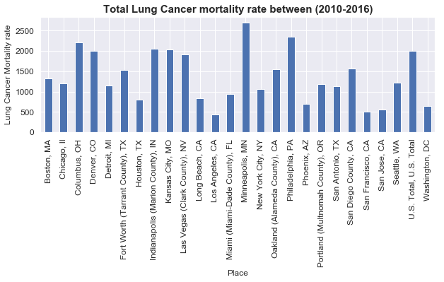
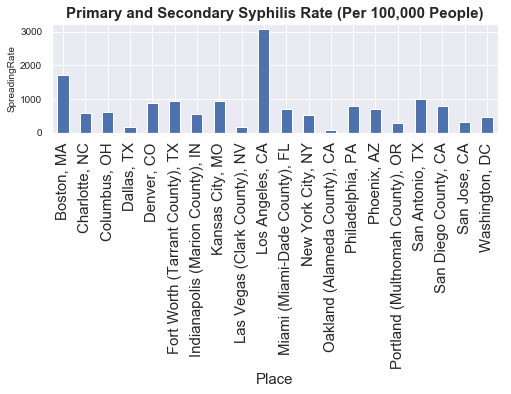
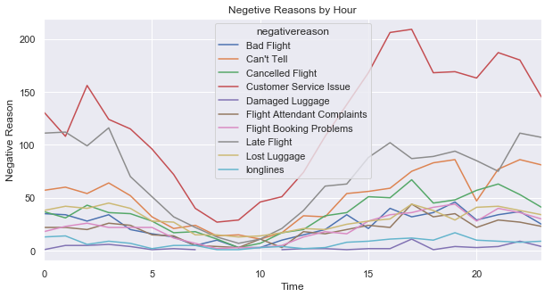

# Airline Sentiment Analysis Project

<h2>Project Objective</h2><br>
    1. Analysing data to visualize airline trends
        <ul>
        <li>What most posetive or negative tweets for each airline service talks about?</li>
        <li>Does time of flight affect quality service?</li>
        <li>Which reason commonly tweeted by customers for bad service?</li>
        <li>Counting for retweeted negative tweets to shows which service is highly affecting.</li>
        </ul>
    2.  Classifying whether the sentiment of the tweets is positive, neutral, or negative using Machine Learning Techniques, then categorizing negative tweets for their reason.

# Data Analysis


```python
import pandas as pd ## for reading and undestanding data
import matplotlib.pyplot as plt ## for plotting data
import seaborn as sns ## another library to visualize data features
import numpy as np ## for numerical array processing
```


```python
##reading data
data=pd.read_csv('twitter-airline/Tweets.csv')
data.head()
```


<div>
<style scoped>
    .dataframe tbody tr th:only-of-type {
        vertical-align: middle;
    }

    .dataframe tbody tr th {
        vertical-align: top;
    }

    .dataframe thead th {
        text-align: right;
    }
</style>
<table border="1" class="dataframe">
  <thead>
    <tr style="text-align: right;">
      <th></th>
      <th>tweet_id</th>
      <th>airline_sentiment</th>
      <th>airline_sentiment_confidence</th>
      <th>negativereason</th>
      <th>negativereason_confidence</th>
      <th>airline</th>
      <th>airline_sentiment_gold</th>
      <th>name</th>
      <th>negativereason_gold</th>
      <th>retweet_count</th>
      <th>text</th>
      <th>tweet_coord</th>
      <th>tweet_created</th>
      <th>tweet_location</th>
      <th>user_timezone</th>
    </tr>
  </thead>
  <tbody>
    <tr>
      <th>0</th>
      <td>570306133677760513</td>
      <td>neutral</td>
      <td>1.0000</td>
      <td>NaN</td>
      <td>NaN</td>
      <td>Virgin America</td>
      <td>NaN</td>
      <td>cairdin</td>
      <td>NaN</td>
      <td>0</td>
      <td>@VirginAmerica What @dhepburn said.</td>
      <td>NaN</td>
      <td>2015-02-24 11:35:52 -0800</td>
      <td>NaN</td>
      <td>Eastern Time (US &amp; Canada)</td>
    </tr>
    <tr>
      <th>1</th>
      <td>570301130888122368</td>
      <td>positive</td>
      <td>0.3486</td>
      <td>NaN</td>
      <td>0.0000</td>
      <td>Virgin America</td>
      <td>NaN</td>
      <td>jnardino</td>
      <td>NaN</td>
      <td>0</td>
      <td>@VirginAmerica plus you've added commercials t...</td>
      <td>NaN</td>
      <td>2015-02-24 11:15:59 -0800</td>
      <td>NaN</td>
      <td>Pacific Time (US &amp; Canada)</td>
    </tr>
    <tr>
      <th>2</th>
      <td>570301083672813571</td>
      <td>neutral</td>
      <td>0.6837</td>
      <td>NaN</td>
      <td>NaN</td>
      <td>Virgin America</td>
      <td>NaN</td>
      <td>yvonnalynn</td>
      <td>NaN</td>
      <td>0</td>
      <td>@VirginAmerica I didn't today... Must mean I n...</td>
      <td>NaN</td>
      <td>2015-02-24 11:15:48 -0800</td>
      <td>Lets Play</td>
      <td>Central Time (US &amp; Canada)</td>
    </tr>
    <tr>
      <th>3</th>
      <td>570301031407624196</td>
      <td>negative</td>
      <td>1.0000</td>
      <td>Bad Flight</td>
      <td>0.7033</td>
      <td>Virgin America</td>
      <td>NaN</td>
      <td>jnardino</td>
      <td>NaN</td>
      <td>0</td>
      <td>@VirginAmerica it's really aggressive to blast...</td>
      <td>NaN</td>
      <td>2015-02-24 11:15:36 -0800</td>
      <td>NaN</td>
      <td>Pacific Time (US &amp; Canada)</td>
    </tr>
    <tr>
      <th>4</th>
      <td>570300817074462722</td>
      <td>negative</td>
      <td>1.0000</td>
      <td>Can't Tell</td>
      <td>1.0000</td>
      <td>Virgin America</td>
      <td>NaN</td>
      <td>jnardino</td>
      <td>NaN</td>
      <td>0</td>
      <td>@VirginAmerica and it's a really big bad thing...</td>
      <td>NaN</td>
      <td>2015-02-24 11:14:45 -0800</td>
      <td>NaN</td>
      <td>Pacific Time (US &amp; Canada)</td>
    </tr>
  </tbody>
</table>
</div>


```python
data=data[['tweet_id','text','airline_sentiment','airline_sentiment_confidence','negativereason','airline','retweet_count','tweet_created']]
```


```python
data.head()
```


<div>
<style scoped>
    .dataframe tbody tr th:only-of-type {
        vertical-align: middle;
    }

    .dataframe tbody tr th {
        vertical-align: top;
    }

    .dataframe thead th {
        text-align: right;
    }
</style>
<table border="1" class="dataframe">
  <thead>
    <tr style="text-align: right;">
      <th></th>
      <th>tweet_id</th>
      <th>text</th>
      <th>airline_sentiment</th>
      <th>airline_sentiment_confidence</th>
      <th>negativereason</th>
      <th>airline</th>
      <th>retweet_count</th>
      <th>tweet_created</th>
    </tr>
  </thead>
  <tbody>
    <tr>
      <th>0</th>
      <td>570306133677760513</td>
      <td>@VirginAmerica What @dhepburn said.</td>
      <td>neutral</td>
      <td>1.0000</td>
      <td>NaN</td>
      <td>Virgin America</td>
      <td>0</td>
      <td>2015-02-24 11:35:52 -0800</td>
    </tr>
    <tr>
      <th>1</th>
      <td>570301130888122368</td>
      <td>@VirginAmerica plus you've added commercials t...</td>
      <td>positive</td>
      <td>0.3486</td>
      <td>NaN</td>
      <td>Virgin America</td>
      <td>0</td>
      <td>2015-02-24 11:15:59 -0800</td>
    </tr>
    <tr>
      <th>2</th>
      <td>570301083672813571</td>
      <td>@VirginAmerica I didn't today... Must mean I n...</td>
      <td>neutral</td>
      <td>0.6837</td>
      <td>NaN</td>
      <td>Virgin America</td>
      <td>0</td>
      <td>2015-02-24 11:15:48 -0800</td>
    </tr>
    <tr>
      <th>3</th>
      <td>570301031407624196</td>
      <td>@VirginAmerica it's really aggressive to blast...</td>
      <td>negative</td>
      <td>1.0000</td>
      <td>Bad Flight</td>
      <td>Virgin America</td>
      <td>0</td>
      <td>2015-02-24 11:15:36 -0800</td>
    </tr>
    <tr>
      <th>4</th>
      <td>570300817074462722</td>
      <td>@VirginAmerica and it's a really big bad thing...</td>
      <td>negative</td>
      <td>1.0000</td>
      <td>Can't Tell</td>
      <td>Virgin America</td>
      <td>0</td>
      <td>2015-02-24 11:14:45 -0800</td>
    </tr>
  </tbody>
</table>
</div>


```python
data.info()
```

    <class 'pandas.core.frame.DataFrame'>
    RangeIndex: 14640 entries, 0 to 14639
    Data columns (total 8 columns):
    tweet_id                        14640 non-null int64
    text                            14640 non-null object
    airline_sentiment               14640 non-null object
    airline_sentiment_confidence    14640 non-null float64
    negativereason                  9178 non-null object
    airline                         14640 non-null object
    retweet_count                   14640 non-null int64
    tweet_created                   14640 non-null object
    dtypes: float64(1), int64(2), object(5)
    memory usage: 915.1+ KB
    


```python
semtiments=pd.crosstab(data.airline, data.airline_sentiment)
semtiments
```


<div>
<style scoped>
    .dataframe tbody tr th:only-of-type {
        vertical-align: middle;
    }

    .dataframe tbody tr th {
        vertical-align: top;
    }

    .dataframe thead th {
        text-align: right;
    }
</style>
<table border="1" class="dataframe">
  <thead>
    <tr style="text-align: right;">
      <th>airline_sentiment</th>
      <th>negative</th>
      <th>neutral</th>
      <th>positive</th>
    </tr>
    <tr>
      <th>airline</th>
      <th></th>
      <th></th>
      <th></th>
    </tr>
  </thead>
  <tbody>
    <tr>
      <th>American</th>
      <td>1960</td>
      <td>463</td>
      <td>336</td>
    </tr>
    <tr>
      <th>Delta</th>
      <td>955</td>
      <td>723</td>
      <td>544</td>
    </tr>
    <tr>
      <th>Southwest</th>
      <td>1186</td>
      <td>664</td>
      <td>570</td>
    </tr>
    <tr>
      <th>US Airways</th>
      <td>2263</td>
      <td>381</td>
      <td>269</td>
    </tr>
    <tr>
      <th>United</th>
      <td>2633</td>
      <td>697</td>
      <td>492</td>
    </tr>
    <tr>
      <th>Virgin America</th>
      <td>181</td>
      <td>171</td>
      <td>152</td>
    </tr>
  </tbody>
</table>
</div>


```python
negative_tweet=data[(data['airline_sentiment']=='negative')]
negative_tweet.head()
```


<div>
<style scoped>
    .dataframe tbody tr th:only-of-type {
        vertical-align: middle;
    }

    .dataframe tbody tr th {
        vertical-align: top;
    }

    .dataframe thead th {
        text-align: right;
    }
</style>
<table border="1" class="dataframe">
  <thead>
    <tr style="text-align: right;">
      <th></th>
      <th>tweet_id</th>
      <th>text</th>
      <th>airline_sentiment</th>
      <th>airline_sentiment_confidence</th>
      <th>negativereason</th>
      <th>airline</th>
      <th>retweet_count</th>
      <th>tweet_created</th>
    </tr>
  </thead>
  <tbody>
    <tr>
      <th>3</th>
      <td>570301031407624196</td>
      <td>@VirginAmerica it's really aggressive to blast...</td>
      <td>negative</td>
      <td>1.0000</td>
      <td>Bad Flight</td>
      <td>Virgin America</td>
      <td>0</td>
      <td>2015-02-24 11:15:36 -0800</td>
    </tr>
    <tr>
      <th>4</th>
      <td>570300817074462722</td>
      <td>@VirginAmerica and it's a really big bad thing...</td>
      <td>negative</td>
      <td>1.0000</td>
      <td>Can't Tell</td>
      <td>Virgin America</td>
      <td>0</td>
      <td>2015-02-24 11:14:45 -0800</td>
    </tr>
    <tr>
      <th>5</th>
      <td>570300767074181121</td>
      <td>@VirginAmerica seriously would pay $30 a fligh...</td>
      <td>negative</td>
      <td>1.0000</td>
      <td>Can't Tell</td>
      <td>Virgin America</td>
      <td>0</td>
      <td>2015-02-24 11:14:33 -0800</td>
    </tr>
    <tr>
      <th>15</th>
      <td>570282469121007616</td>
      <td>@VirginAmerica SFO-PDX schedule is still MIA.</td>
      <td>negative</td>
      <td>0.6842</td>
      <td>Late Flight</td>
      <td>Virgin America</td>
      <td>0</td>
      <td>2015-02-24 10:01:50 -0800</td>
    </tr>
    <tr>
      <th>17</th>
      <td>570276917301137409</td>
      <td>@VirginAmerica  I flew from NYC to SFO last we...</td>
      <td>negative</td>
      <td>1.0000</td>
      <td>Bad Flight</td>
      <td>Virgin America</td>
      <td>0</td>
      <td>2015-02-24 09:39:46 -0800</td>
    </tr>
  </tbody>
</table>
</div>


Most common words in negative tweets


```python
negative_tweet.airline.value_counts() #counts number of negative rate for each airline to identify worse airway of 2015
```


    United            2633
    US Airways        2263
    American          1960
    Southwest         1186
    Delta              955
    Virgin America     181
    Name: airline, dtype: int64


```python
from wordcloud import WordCloud
def plotWords(words):
    wordcloud=WordCloud(width=1200, height=600, random_state=21,max_font_size=110).generate(words)
    plt.figure(figsize=(10,7))
    plt.imshow(wordcloud,interpolation="bilinear")
    plt.axis('off')
    plt.show()
```


```python
neg_tweet_words=negative_tweet.text.values.tolist()
neg_words=' '.join([text for text in neg_tweet_words])
plotWords(neg_words)
```


The plot is showing wich airline service is more tweeted for negative sentiment and reason for negativity.

Lets look at posetive comments to understand services on which customers are more satisfied.


```python
posetive_tweet=data[(data['airline_sentiment']=='positive')]
pos_tweet_words=posetive_tweet.text.values.tolist()
pos_words=' '.join([text for text in pos_tweet_words])
plotWords(pos_words)
```


appreciate, good, thanks, really, great, amazing, best, nice, happy, ... shows services on which customers are ok with airlines.


```python
def plot_bar(title,x_label,y_label,data):
    fig, ax = plt.subplots(figsize=(10, 3))
    ax.tick_params(axis='x', labelsize=12)
    ax.tick_params(axis='y', labelsize=12)
    ax.set_ylabel(y_label , fontsize=12)
    ax.set_title(title, fontsize=15, fontweight='bold')
    _=data.plot(kind='bar')
```


```python
reason_count=negative_tweet['negativereason'].value_counts()
_=reason_count.plot(kind='bar')
```


```python
airline_neg_reason=negative_tweet.groupby('airline')['negativereason'].value_counts()
airline_neg_reason.unstack()
```


<div>
<style scoped>
    .dataframe tbody tr th:only-of-type {
        vertical-align: middle;
    }

    .dataframe tbody tr th {
        vertical-align: top;
    }

    .dataframe thead th {
        text-align: right;
    }
</style>
<table border="1" class="dataframe">
  <thead>
    <tr style="text-align: right;">
      <th>negativereason</th>
      <th>Bad Flight</th>
      <th>Can't Tell</th>
      <th>Cancelled Flight</th>
      <th>Customer Service Issue</th>
      <th>Damaged Luggage</th>
      <th>Flight Attendant Complaints</th>
      <th>Flight Booking Problems</th>
      <th>Late Flight</th>
      <th>Lost Luggage</th>
      <th>longlines</th>
    </tr>
    <tr>
      <th>airline</th>
      <th></th>
      <th></th>
      <th></th>
      <th></th>
      <th></th>
      <th></th>
      <th></th>
      <th></th>
      <th></th>
      <th></th>
    </tr>
  </thead>
  <tbody>
    <tr>
      <th>American</th>
      <td>87</td>
      <td>198</td>
      <td>246</td>
      <td>768</td>
      <td>12</td>
      <td>87</td>
      <td>130</td>
      <td>249</td>
      <td>149</td>
      <td>34</td>
    </tr>
    <tr>
      <th>Delta</th>
      <td>64</td>
      <td>186</td>
      <td>51</td>
      <td>199</td>
      <td>11</td>
      <td>60</td>
      <td>44</td>
      <td>269</td>
      <td>57</td>
      <td>14</td>
    </tr>
    <tr>
      <th>Southwest</th>
      <td>90</td>
      <td>159</td>
      <td>162</td>
      <td>391</td>
      <td>14</td>
      <td>38</td>
      <td>61</td>
      <td>152</td>
      <td>90</td>
      <td>29</td>
    </tr>
    <tr>
      <th>US Airways</th>
      <td>104</td>
      <td>246</td>
      <td>189</td>
      <td>811</td>
      <td>11</td>
      <td>123</td>
      <td>122</td>
      <td>453</td>
      <td>154</td>
      <td>50</td>
    </tr>
    <tr>
      <th>United</th>
      <td>216</td>
      <td>379</td>
      <td>181</td>
      <td>681</td>
      <td>22</td>
      <td>168</td>
      <td>144</td>
      <td>525</td>
      <td>269</td>
      <td>48</td>
    </tr>
    <tr>
      <th>Virgin America</th>
      <td>19</td>
      <td>22</td>
      <td>18</td>
      <td>60</td>
      <td>4</td>
      <td>5</td>
      <td>28</td>
      <td>17</td>
      <td>5</td>
      <td>3</td>
    </tr>
  </tbody>
</table>
</div>


```python
def plot_sns(x,y,data):
    sns.set(rc={'figure.figsize':(10,10)})
    ax=sns.countplot(y=y,hue=x,data=data)
    for p in ax.patches:
        patch_height = p.get_height()
        if np.isnan(patch_height):
            patch_height = 0
        ax.annotate('{}'.format(int(patch_height)), (p.get_x()+0.01, patch_height+0.5),ha = 'center', va = 'center', xytext = (0, 10), textcoords = 'offset points')
    plt.title("Distribution of negative reason for each airline")
    plt.show()
plot_sns('negativereason','airline',negative_tweet)

# plt.figure(figsize=(6, 8))
# splot = sns.barplot(data=df, x = 'sex', y = 'total_bill', ci = None)
# for p in splot.patches:
# splot.annotate(format(p.get_height(), '.2f'), (p.get_x() + p.get_width() / 2., p.get_height()),
#                ha = 'center', va = 'center', xytext = (0, 10), textcoords = 'offset points')
```





The plot and table above interstingly depicts the United, US, and American airlines has worest service than Delta, Virgin America, and Southwest airlines. Except, Delta and Virgin America airways, the rest four has no good customer handling and United and US airways also mostly late on flight time. Comaratively, Virgin America is good than other and then Delta is next choise.

# Does flight time has relation to negative reason?

We will focus on top three airlines with negative sentiment


```python
#time based analysis
data['tweet_created']=data['tweet_created'].astype('datetime64[ns]') ## conversion of data type to datetime
data.head()
```


<div>
<style scoped>
    .dataframe tbody tr th:only-of-type {
        vertical-align: middle;
    }

    .dataframe tbody tr th {
        vertical-align: top;
    }

    .dataframe thead th {
        text-align: right;
    }
</style>
<table border="1" class="dataframe">
  <thead>
    <tr style="text-align: right;">
      <th></th>
      <th>tweet_id</th>
      <th>text</th>
      <th>airline_sentiment</th>
      <th>airline_sentiment_confidence</th>
      <th>negativereason</th>
      <th>airline</th>
      <th>retweet_count</th>
      <th>tweet_created</th>
    </tr>
  </thead>
  <tbody>
    <tr>
      <th>0</th>
      <td>570306133677760513</td>
      <td>@VirginAmerica What @dhepburn said.</td>
      <td>neutral</td>
      <td>1.0000</td>
      <td>NaN</td>
      <td>Virgin America</td>
      <td>0</td>
      <td>2015-02-24 19:35:52</td>
    </tr>
    <tr>
      <th>1</th>
      <td>570301130888122368</td>
      <td>@VirginAmerica plus you've added commercials t...</td>
      <td>positive</td>
      <td>0.3486</td>
      <td>NaN</td>
      <td>Virgin America</td>
      <td>0</td>
      <td>2015-02-24 19:15:59</td>
    </tr>
    <tr>
      <th>2</th>
      <td>570301083672813571</td>
      <td>@VirginAmerica I didn't today... Must mean I n...</td>
      <td>neutral</td>
      <td>0.6837</td>
      <td>NaN</td>
      <td>Virgin America</td>
      <td>0</td>
      <td>2015-02-24 19:15:48</td>
    </tr>
    <tr>
      <th>3</th>
      <td>570301031407624196</td>
      <td>@VirginAmerica it's really aggressive to blast...</td>
      <td>negative</td>
      <td>1.0000</td>
      <td>Bad Flight</td>
      <td>Virgin America</td>
      <td>0</td>
      <td>2015-02-24 19:15:36</td>
    </tr>
    <tr>
      <th>4</th>
      <td>570300817074462722</td>
      <td>@VirginAmerica and it's a really big bad thing...</td>
      <td>negative</td>
      <td>1.0000</td>
      <td>Can't Tell</td>
      <td>Virgin America</td>
      <td>0</td>
      <td>2015-02-24 19:14:45</td>
    </tr>
  </tbody>
</table>
</div>


```python
data['tweet_created_date']=data.tweet_created.dt.date
data['tweet_created_weekday_name']=data.tweet_created.dt.weekday_name
data['tweet_created_hour']=data.tweet_created.dt.hour
data.head()
```


<div>
<style scoped>
    .dataframe tbody tr th:only-of-type {
        vertical-align: middle;
    }

    .dataframe tbody tr th {
        vertical-align: top;
    }

    .dataframe thead th {
        text-align: right;
    }
</style>
<table border="1" class="dataframe">
  <thead>
    <tr style="text-align: right;">
      <th></th>
      <th>tweet_id</th>
      <th>text</th>
      <th>airline_sentiment</th>
      <th>airline_sentiment_confidence</th>
      <th>negativereason</th>
      <th>airline</th>
      <th>retweet_count</th>
      <th>tweet_created</th>
      <th>tweet_created_date</th>
      <th>tweet_created_weekday_name</th>
      <th>tweet_created_hour</th>
    </tr>
  </thead>
  <tbody>
    <tr>
      <th>0</th>
      <td>570306133677760513</td>
      <td>@VirginAmerica What @dhepburn said.</td>
      <td>neutral</td>
      <td>1.0000</td>
      <td>NaN</td>
      <td>Virgin America</td>
      <td>0</td>
      <td>2015-02-24 19:35:52</td>
      <td>2015-02-24</td>
      <td>Tuesday</td>
      <td>19</td>
    </tr>
    <tr>
      <th>1</th>
      <td>570301130888122368</td>
      <td>@VirginAmerica plus you've added commercials t...</td>
      <td>positive</td>
      <td>0.3486</td>
      <td>NaN</td>
      <td>Virgin America</td>
      <td>0</td>
      <td>2015-02-24 19:15:59</td>
      <td>2015-02-24</td>
      <td>Tuesday</td>
      <td>19</td>
    </tr>
    <tr>
      <th>2</th>
      <td>570301083672813571</td>
      <td>@VirginAmerica I didn't today... Must mean I n...</td>
      <td>neutral</td>
      <td>0.6837</td>
      <td>NaN</td>
      <td>Virgin America</td>
      <td>0</td>
      <td>2015-02-24 19:15:48</td>
      <td>2015-02-24</td>
      <td>Tuesday</td>
      <td>19</td>
    </tr>
    <tr>
      <th>3</th>
      <td>570301031407624196</td>
      <td>@VirginAmerica it's really aggressive to blast...</td>
      <td>negative</td>
      <td>1.0000</td>
      <td>Bad Flight</td>
      <td>Virgin America</td>
      <td>0</td>
      <td>2015-02-24 19:15:36</td>
      <td>2015-02-24</td>
      <td>Tuesday</td>
      <td>19</td>
    </tr>
    <tr>
      <th>4</th>
      <td>570300817074462722</td>
      <td>@VirginAmerica and it's a really big bad thing...</td>
      <td>negative</td>
      <td>1.0000</td>
      <td>Can't Tell</td>
      <td>Virgin America</td>
      <td>0</td>
      <td>2015-02-24 19:14:45</td>
      <td>2015-02-24</td>
      <td>Tuesday</td>
      <td>19</td>
    </tr>
  </tbody>
</table>
</div>


```python
negative_tweet=data[(data['airline_sentiment']=='negative')]
neg_by_wkday = negative_tweet.groupby(['tweet_created_weekday_name']).negativereason.value_counts()
neg_by_wkday.unstack()
```


<div>
<style scoped>
    .dataframe tbody tr th:only-of-type {
        vertical-align: middle;
    }

    .dataframe tbody tr th {
        vertical-align: top;
    }

    .dataframe thead th {
        text-align: right;
    }
</style>
<table border="1" class="dataframe">
  <thead>
    <tr style="text-align: right;">
      <th>negativereason</th>
      <th>Bad Flight</th>
      <th>Can't Tell</th>
      <th>Cancelled Flight</th>
      <th>Customer Service Issue</th>
      <th>Damaged Luggage</th>
      <th>Flight Attendant Complaints</th>
      <th>Flight Booking Problems</th>
      <th>Late Flight</th>
      <th>Lost Luggage</th>
      <th>longlines</th>
    </tr>
    <tr>
      <th>tweet_created_weekday_name</th>
      <th></th>
      <th></th>
      <th></th>
      <th></th>
      <th></th>
      <th></th>
      <th></th>
      <th></th>
      <th></th>
      <th></th>
    </tr>
  </thead>
  <tbody>
    <tr>
      <th>Friday</th>
      <td>71</td>
      <td>119</td>
      <td>52</td>
      <td>207</td>
      <td>4</td>
      <td>41</td>
      <td>47</td>
      <td>237</td>
      <td>57</td>
      <td>14</td>
    </tr>
    <tr>
      <th>Monday</th>
      <td>121</td>
      <td>316</td>
      <td>227</td>
      <td>791</td>
      <td>13</td>
      <td>105</td>
      <td>122</td>
      <td>399</td>
      <td>207</td>
      <td>45</td>
    </tr>
    <tr>
      <th>Saturday</th>
      <td>55</td>
      <td>117</td>
      <td>100</td>
      <td>313</td>
      <td>9</td>
      <td>42</td>
      <td>56</td>
      <td>135</td>
      <td>53</td>
      <td>21</td>
    </tr>
    <tr>
      <th>Sunday</th>
      <td>103</td>
      <td>175</td>
      <td>210</td>
      <td>547</td>
      <td>11</td>
      <td>105</td>
      <td>73</td>
      <td>360</td>
      <td>121</td>
      <td>39</td>
    </tr>
    <tr>
      <th>Thursday</th>
      <td>57</td>
      <td>108</td>
      <td>31</td>
      <td>197</td>
      <td>5</td>
      <td>37</td>
      <td>54</td>
      <td>124</td>
      <td>38</td>
      <td>15</td>
    </tr>
    <tr>
      <th>Tuesday</th>
      <td>112</td>
      <td>241</td>
      <td>173</td>
      <td>615</td>
      <td>19</td>
      <td>102</td>
      <td>128</td>
      <td>268</td>
      <td>160</td>
      <td>27</td>
    </tr>
    <tr>
      <th>Wednesday</th>
      <td>61</td>
      <td>114</td>
      <td>54</td>
      <td>240</td>
      <td>13</td>
      <td>49</td>
      <td>49</td>
      <td>142</td>
      <td>88</td>
      <td>17</td>
    </tr>
  </tbody>
</table>
</div>


```python
neg_by_wkday = neg_by_wkday.unstack().plot(kind='line',figsize=(10,5),rot=0,title="Negetive Reasons by Day of Week")
neg_by_wkday.set_xlabel("Day of Week")
neg_by_wkday.set_ylabel("Negative Reason")
```


    Text(0, 0.5, 'Negative Reason')





The plot clearly depicts expect Friday, Saturday, Thursady and Wednesday flights are comaratively good. Monday, Sunday and Tuesday flights has customer service problem and are mostly late (the green lines also shows that probability of cancelation of flights by Monday, Sunday and Tuesday is high).


```python
neg_by_time = negative_tweet.groupby(['tweet_created_hour']).negativereason.value_counts()

neg_by_time = neg_by_time.unstack().plot(kind='line',figsize=(10, 5),title="Negetive Reasons by Hour")
neg_by_time.set_xlabel("Time")
neg_by_time.set_ylabel("Negative Reason")
```


    Text(0, 0.5, 'Negative Reason')





Time based analysis is showing something good look to optimize airline service.
<ul>
    <li>Relatively good customer sutisfaction period (6 A.M to 10 A.M) </li>
    <li>7:AM to 9:AM less customer service issue </li>
    <li>1:pm to 7:pm almost no late flight</li>
    <li>9:AM no cancelled flight</li>
  </ul>

<b>Flights at time range 0:00 A.M -03:00 A.M and 04:00 PM - 06:00 PM are with high customer dististfaction.</b>
