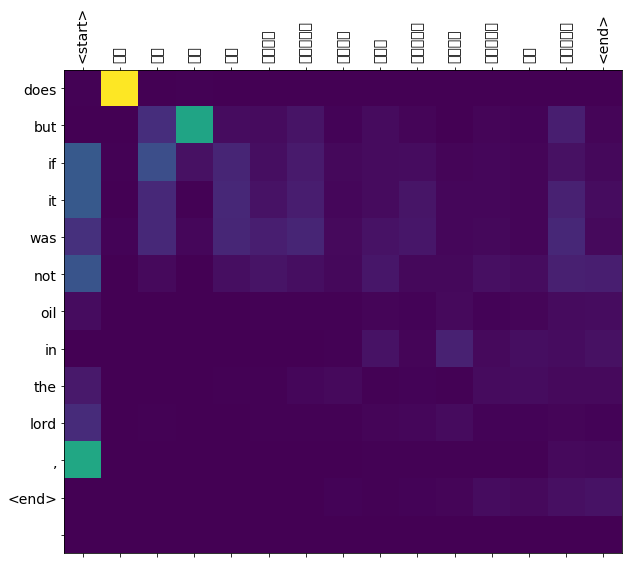

```python
import warnings
warnings.filterwarnings('ignore',category=FutureWarning)
from pickle import load
from numpy import array
from keras.preprocessing.text import Tokenizer
from keras.preprocessing.sequence import pad_sequences
from keras.utils.vis_utils import plot_model
import tensorflow as tf
import os
import time
```

    Using TensorFlow backend.
    


```python
import os
for dirname, _, filenames in os.walk('/kaggle/input'):
    for filename in filenames: 
        print(os.path.join(dirname, filename))
```

    /kaggle/input/am-en-mt-dataset/am-en-both.pkl
    /kaggle/input/am-en-mt-dataset/am-en-test.pkl
    /kaggle/input/am-en-mt-dataset/am-en-train.pkl
    


```python
# load a clean dataset
def load_clean_sentences(filename):
	return load(open('/kaggle/input/am-en-mt-dataset/'+filename, 'rb'))
```


```python
# fit a tokenizer
def create_tokenizer(data):
	tokenizer = Tokenizer(filters='')
	tokenizer.fit_on_texts(data)
	return tokenizer

# max sentence length
def max_length(lines):
	return max(len(line.split()) for line in lines)

# load datasets
dataset = load_clean_sentences('am-en-both.pkl')
train = load_clean_sentences('am-en-train.pkl')
test = load_clean_sentences('am-en-test.pkl')
# prepare amharic tokenizer
am_tokenizer = create_tokenizer(dataset[:, 0].tolist())
am_vocab_size = len(am_tokenizer.word_index) + 1
am_length = max_length(dataset[:, 0])
print('Amharic Vocabulary Size: %d' % am_vocab_size)
print('Amharic Max Length: %d' % (am_length))
# prepare english tokenizer
en_tokenizer = create_tokenizer(dataset[:, 1].tolist())
en_vocab_size = len(en_tokenizer.word_index) + 1
en_length = max_length(dataset[:, 1])
print('English Vocabulary Size: %d' % en_vocab_size)
print('English Max Length: %d' % (en_length))
```

    Amharic Vocabulary Size: 72705
    Amharic Max Length: 56
    English Vocabulary Size: 15881
    English Max Length: 98
    


```python
def prepare_seq(data,lang_tokenizer):
    lang_tokenizer.fit_on_texts(data)
    tensor = lang_tokenizer.texts_to_sequences(data)
    tensor = pad_sequences(tensor,padding='post')
    return tensor
```


```python
am_train=train[:, 0].tolist()
en_train=train[:, 1].tolist()
am_test=test[:, 0].tolist()
en_test=test[:, 1].tolist()
# # prepare training data
trainX=prepare_seq(am_train, am_tokenizer)
trainY=prepare_seq(en_train, en_tokenizer)
# prepare validation data
testX = prepare_seq(am_test,am_tokenizer)
testY = prepare_seq(en_test, en_tokenizer)
```


```python
print(len(trainX),len(trainY),len(testX),len(testY))
```

    25000 25000 5000 5000
    


```python
def convert(lang, tensor):
    for t in tensor:
        if t!=0:
            print ("%d ----> %s" % (t, lang.index_word[t]))
print ("Input Language; index to word mapping")
convert(am_tokenizer, trainX[0])
print ()
print ("Target Language; index to word mapping")
convert(en_tokenizer, trainY[0])
```

    Input Language; index to word mapping
    2 ----> <start>
    51 ----> ፯
    64 ----> ፲፭
    7725 ----> ፃድቁንም
    12833 ----> መለስ
    9102 ----> በነበርንበት
    488 ----> ዙሪያ
    7 ----> ላይ
    30306 ----> እንድትድኑ
    4 ----> ፤
    8437 ----> አኪቃም
    515 ----> የነበረውን
    13988 ----> ለመመዝገብ
    1 ----> ።
    3 ----> <end>
    
    Target Language; index to word mapping
    5 ----> <start>
    106 ----> 7
    44 ----> so
    20 ----> they
    3390 ----> silas
    1296 ----> bound
    33 ----> on
    1 ----> the
    907 ----> reigned
    17 ----> that
    12 ----> he
    58 ----> had
    885 ----> prepared
    14 ----> for
    1287 ----> crossed
    2 ----> ,
    4 ----> and
    1 ----> the
    206 ----> fire
    1081 ----> secret
    5157 ----> na·thana·el
    3 ----> .
    6 ----> <end>
    


```python
BUFFER_SIZE = len(trainX)
BATCH_SIZE = 64
steps_per_epoch = len(trainX)//BATCH_SIZE
embedding_dim = 100
units = 1024

dataset = tf.data.Dataset.from_tensor_slices((trainX, trainY)).shuffle(BUFFER_SIZE)
dataset = dataset.batch(BATCH_SIZE, drop_remainder=True)
```


```python
x_batch, y_batch = next(iter(dataset))
x_batch.shape, y_batch.shape
```


    (TensorShape([64, 56]), TensorShape([64, 98]))


```python
class Encoder(tf.keras.Model):
  def __init__(self, vocab_size, embedding_dim, enc_units, batch_sz):
    super(Encoder, self).__init__()
    self.batch_sz = batch_sz
    self.enc_units = enc_units
    self.embedding = tf.keras.layers.Embedding(vocab_size, embedding_dim)
    self.gru = tf.keras.layers.GRU(self.enc_units,
                                   return_sequences=True,
                                   return_state=True,
                                   recurrent_initializer='glorot_uniform')

  def call(self, x, hidden):
    x = self.embedding(x)
    output, state = self.gru(x, initial_state = hidden)
    return output, state

  def initialize_hidden_state(self):
    return tf.zeros((self.batch_sz, self.enc_units))
```


```python
encoder = Encoder(am_vocab_size, embedding_dim, units, BATCH_SIZE)

# sample input
sample_hidden = encoder.initialize_hidden_state()
sample_output, sample_hidden = encoder(x_batch, sample_hidden)
print ('Encoder output shape: (batch size, sequence length, units) {}'.format(sample_output.shape))
print ('Encoder Hidden state shape: (batch size, units) {}'.format(sample_hidden.shape))
```

    Encoder output shape: (batch size, sequence length, units) (64, 56, 1024)
    Encoder Hidden state shape: (batch size, units) (64, 1024)
    


```python
class BahdanauAttention(tf.keras.layers.Layer):
  def __init__(self, units):
    super(BahdanauAttention, self).__init__()
    self.W1 = tf.keras.layers.Dense(units)
    self.W2 = tf.keras.layers.Dense(units)
    self.V = tf.keras.layers.Dense(1)

  def call(self, query, values):
    # hidden shape == (batch_size, hidden size)
    # hidden_with_time_axis shape == (batch_size, 1, hidden size)
    # we are doing this to perform addition to calculate the score
    hidden_with_time_axis = tf.expand_dims(query, 1)

    # score shape == (batch_size, max_length, 1)
    # we get 1 at the last axis because we are applying score to self.V
    # the shape of the tensor before applying self.V is (batch_size, max_length, units)
    score = self.V(tf.nn.tanh(
        self.W1(values) + self.W2(hidden_with_time_axis)))

    # attention_weights shape == (batch_size, max_length, 1)
    attention_weights = tf.nn.softmax(score, axis=1)

    # context_vector shape after sum == (batch_size, hidden_size)
    context_vector = attention_weights * values
    context_vector = tf.reduce_sum(context_vector, axis=1)

    return context_vector, attention_weights

attention_layer = BahdanauAttention(10)
attention_result, attention_weights = attention_layer(sample_hidden, sample_output)
print("Attention result shape: (batch size, units) {}".format(attention_result.shape))
print("Attention weights shape: (batch_size, sequence_length, 1) {}".format(attention_weights.shape))
```

    Attention result shape: (batch size, units) (64, 1024)
    Attention weights shape: (batch_size, sequence_length, 1) (64, 56, 1)
    


```python
class Decoder(tf.keras.Model):
  def __init__(self, vocab_size, embedding_dim, dec_units, batch_sz):
    super(Decoder, self).__init__()
    self.batch_sz = batch_sz
    self.dec_units = dec_units
    self.embedding = tf.keras.layers.Embedding(vocab_size, embedding_dim)
    self.gru = tf.keras.layers.GRU(self.dec_units,
                                   return_sequences=True,
                                   return_state=True,
                                   recurrent_initializer='glorot_uniform')
    self.fc = tf.keras.layers.Dense(vocab_size)

    # used for attention
    self.attention = BahdanauAttention(self.dec_units)

  def call(self, x, hidden, enc_output):
    # enc_output shape == (batch_size, max_length, hidden_size)
    context_vector, attention_weights = self.attention(hidden, enc_output)

    # x shape after passing through embedding == (batch_size, 1, embedding_dim)
    x = self.embedding(x)

    # x shape after concatenation == (batch_size, 1, embedding_dim + hidden_size)
    x = tf.concat([tf.expand_dims(context_vector, 1), x], axis=-1)

    # passing the concatenated vector to the GRU
    output, state = self.gru(x)

    # output shape == (batch_size * 1, hidden_size)
    output = tf.reshape(output, (-1, output.shape[2]))

    # output shape == (batch_size, vocab)
    x = self.fc(output)

    return x, state, attention_weights
```


```python
decoder = Decoder(en_vocab_size, embedding_dim, units, BATCH_SIZE)

sample_decoder_output, _, _ = decoder(tf.random.uniform((BATCH_SIZE, 1)),
                                      sample_hidden, sample_output)

print ('Decoder output shape: (batch_size, vocab size) {}'.format(sample_decoder_output.shape))
```

    Decoder output shape: (batch_size, vocab size) (64, 15881)
    


```python
optimizer = tf.keras.optimizers.Adam()
loss_object = tf.keras.losses.SparseCategoricalCrossentropy(
    from_logits=True, reduction='none')

def loss_function(real, pred):
  mask = tf.math.logical_not(tf.math.equal(real, 0))
  loss_ = loss_object(real, pred)

  mask = tf.cast(mask, dtype=loss_.dtype)
  loss_ *= mask

  return tf.reduce_mean(loss_)
```


```python
checkpoint_dir = './training_checkpoints'
checkpoint_prefix = os.path.join(checkpoint_dir, "ckpt")
checkpoint = tf.train.Checkpoint(optimizer=optimizer,
                                 encoder=encoder,
                                 decoder=decoder)
```


```python
@tf.function
def train_step(inp, targ, enc_hidden):
  loss = 0

  with tf.GradientTape() as tape:
    enc_output, enc_hidden = encoder(inp, enc_hidden)

    dec_hidden = enc_hidden

    dec_input = tf.expand_dims([en_tokenizer.word_index['<start>']] * BATCH_SIZE, 1)

    # Teacher forcing - feeding the target as the next input
    for t in range(1, targ.shape[1]):
      # passing enc_output to the decoder
      predictions, dec_hidden, _ = decoder(dec_input, dec_hidden, enc_output)

      loss += loss_function(targ[:, t], predictions)

      # using teacher forcing
      dec_input = tf.expand_dims(targ[:, t], 1)

  batch_loss = (loss / int(targ.shape[1]))

  variables = encoder.trainable_variables + decoder.trainable_variables

  gradients = tape.gradient(loss, variables)

  optimizer.apply_gradients(zip(gradients, variables))

  return batch_loss

EPOCHS = 10

for epoch in range(EPOCHS):
  start = time.time()

  enc_hidden = encoder.initialize_hidden_state()
  total_loss = 0

  for (batch, (inp, targ)) in enumerate(dataset.take(steps_per_epoch)):
    batch_loss = train_step(inp, targ, enc_hidden)
    total_loss += batch_loss

    if batch % 100 == 0:
      print('Epoch {} Batch {} Loss {:.4f}'.format(epoch + 1,
                                                   batch,
                                                   batch_loss.numpy()))
  # saving (checkpoint) the model every 2 epochs
  if (epoch + 1) % 2 == 0:
    checkpoint.save(file_prefix = checkpoint_prefix)

  print('Epoch {} Loss {:.4f}'.format(epoch + 1,
                                      total_loss / steps_per_epoch))
  print('Time taken for 1 epoch {} sec\n'.format(time.time() - start))

```

    Epoch 1 Batch 0 Loss 2.9657
    Epoch 1 Batch 100 Loss 1.8474
    Epoch 1 Batch 200 Loss 1.5982
    Epoch 1 Batch 300 Loss 1.6906
    Epoch 1 Loss 1.7903
    Time taken for 1 epoch 446.7812497615814 sec
    
    Epoch 2 Batch 0 Loss 1.6074
    Epoch 2 Batch 100 Loss 1.5171
    Epoch 2 Batch 200 Loss 1.5066
    Epoch 2 Batch 300 Loss 1.4055
    Epoch 2 Loss 1.5082
    Time taken for 1 epoch 317.6664056777954 sec
    
    Epoch 3 Batch 0 Loss 1.3750
    Epoch 3 Batch 100 Loss 1.2758
    Epoch 3 Batch 200 Loss 1.3768
    Epoch 3 Batch 300 Loss 1.2888
    Epoch 3 Loss 1.3280
    Time taken for 1 epoch 318.0388603210449 sec
    
    Epoch 4 Batch 0 Loss 1.0995
    Epoch 4 Batch 100 Loss 1.1701
    Epoch 4 Batch 200 Loss 1.3564
    Epoch 4 Batch 300 Loss 1.2092
    Epoch 4 Loss 1.2142
    Time taken for 1 epoch 318.29970240592957 sec
    
    Epoch 5 Batch 0 Loss 1.2254
    Epoch 5 Batch 100 Loss 1.1753
    Epoch 5 Batch 200 Loss 1.1432
    Epoch 5 Batch 300 Loss 1.0978
    Epoch 5 Loss 1.1250
    Time taken for 1 epoch 317.6780345439911 sec
    
    Epoch 6 Batch 0 Loss 0.9184
    Epoch 6 Batch 100 Loss 0.9374
    Epoch 6 Batch 200 Loss 1.2070
    Epoch 6 Batch 300 Loss 1.0207
    Epoch 6 Loss 1.0468
    Time taken for 1 epoch 318.3552486896515 sec
    
    Epoch 7 Batch 0 Loss 0.9537
    Epoch 7 Batch 100 Loss 0.9725
    Epoch 7 Batch 200 Loss 1.0686
    Epoch 7 Batch 300 Loss 1.0371
    Epoch 7 Loss 0.9777
    Time taken for 1 epoch 317.72064185142517 sec
    
    Epoch 8 Batch 0 Loss 0.9688
    Epoch 8 Batch 100 Loss 0.8350
    Epoch 8 Batch 200 Loss 0.8334
    Epoch 8 Batch 300 Loss 1.0320
    Epoch 8 Loss 0.9131
    Time taken for 1 epoch 318.37996006011963 sec
    
    Epoch 9 Batch 0 Loss 0.7715
    Epoch 9 Batch 100 Loss 0.8917
    Epoch 9 Batch 200 Loss 0.8646
    Epoch 9 Batch 300 Loss 0.8058
    Epoch 9 Loss 0.8515
    Time taken for 1 epoch 317.5151901245117 sec
    
    Epoch 10 Batch 0 Loss 0.7025
    Epoch 10 Batch 100 Loss 0.7091
    Epoch 10 Batch 200 Loss 0.7524
    Epoch 10 Batch 300 Loss 0.8210
    Epoch 10 Loss 0.7932
    Time taken for 1 epoch 318.22093963623047 sec
    
    


```python
import warnings
warnings.filterwarnings('ignore',category=FutureWarning)

###preprocess
import re
import os
import numpy as np
def normalize_char_level_missmatch(input_token):
    rep1=re.sub('[ሃኅኃሐሓኻ]','ሀ',input_token)
    rep2=re.sub('[ሑኁዅ]','ሁ',rep1)
    rep3=re.sub('[ኂሒኺ]','ሂ',rep2)
    rep4=re.sub('[ኌሔዄ]','ሄ',rep3)
    rep5=re.sub('[ሕኅ]','ህ',rep4)
    rep6=re.sub('[ኆሖኾ]','ሆ',rep5)
    rep7=re.sub('[ሠ]','ሰ',rep6)
    rep8=re.sub('[ሡ]','ሱ',rep7)
    rep9=re.sub('[ሢ]','ሲ',rep8)
    rep10=re.sub('[ሣ]','ሳ',rep9)
    rep11=re.sub('[ሤ]','ሴ',rep10)
    rep12=re.sub('[ሥ]','ስ',rep11)
    rep13=re.sub('[ሦ]','ሶ',rep12)
    rep14=re.sub('[ዓኣዐ]','አ',rep13)
    rep15=re.sub('[ዑ]','ኡ',rep14)
    rep16=re.sub('[ዒ]','ኢ',rep15)
    rep17=re.sub('[ዔ]','ኤ',rep16)
    rep18=re.sub('[ዕ]','እ',rep17)
    rep19=re.sub('[ዖ]','ኦ',rep18)
    rep20=re.sub('[ጸ]','ፀ',rep19)
    rep21=re.sub('[ጹ]','ፁ',rep20)
    rep22=re.sub('[ጺ]','ፂ',rep21)
    rep23=re.sub('[ጻ]','ፃ',rep22)
    rep24=re.sub('[ጼ]','ፄ',rep23)
    rep25=re.sub('[ጽ]','ፅ',rep24)
    rep26=re.sub('[ጾ]','ፆ',rep25)
    #Normalizing words with Labialized Amharic characters such as በልቱዋል or  በልቱአል to  በልቷል  
    rep27=re.sub('(ሉ[ዋአ])','ሏ',rep26)
    rep28=re.sub('(ሙ[ዋአ])','ሟ',rep27)
    rep29=re.sub('(ቱ[ዋአ])','ቷ',rep28)
    rep30=re.sub('(ሩ[ዋአ])','ሯ',rep29)
    rep31=re.sub('(ሱ[ዋአ])','ሷ',rep30)
    rep32=re.sub('(ሹ[ዋአ])','ሿ',rep31)
    rep33=re.sub('(ቁ[ዋአ])','ቋ',rep32)
    rep34=re.sub('(ቡ[ዋአ])','ቧ',rep33)
    rep35=re.sub('(ቹ[ዋአ])','ቿ',rep34)
    rep36=re.sub('(ሁ[ዋአ])','ኋ',rep35)
    rep37=re.sub('(ኑ[ዋአ])','ኗ',rep36)
    rep38=re.sub('(ኙ[ዋአ])','ኟ',rep37)
    rep39=re.sub('(ኩ[ዋአ])','ኳ',rep38)
    rep40=re.sub('(ዙ[ዋአ])','ዟ',rep39)
    rep41=re.sub('(ጉ[ዋአ])','ጓ',rep40)
    rep42=re.sub('(ደ[ዋአ])','ዷ',rep41)
    rep43=re.sub('(ጡ[ዋአ])','ጧ',rep42)
    rep44=re.sub('(ጩ[ዋአ])','ጯ',rep43)
    rep45=re.sub('(ጹ[ዋአ])','ጿ',rep44)
    rep46=re.sub('(ፉ[ዋአ])','ፏ',rep45)
    rep47=re.sub('[ቊ]','ቁ',rep46) #ቁ can be written as ቊ
    rep48=re.sub('[ኵ]','ኩ',rep47) #ኩ can be also written as ኵ  

    return rep48

#remove all ascii characters and punctuation marks
def remove_ascii(text_input):
    rm_num_and_ascii=re.sub('[A-Za-z]','',remove_punc_and_special_chars(text_input))
    return rm_num_and_ascii

def arabic2geez(arabicNumber):
    ETHIOPIC_ONE= 0x1369
    ETHIOPIC_TEN= 0x1372
    ETHIOPIC_HUNDRED= 0x137B
    ETHIOPIC_TEN_THOUSAND = 0x137C
    arabicNumber=str(arabicNumber)
    n = len(arabicNumber)-1 #length of arabic number
    if n%2 == 0:
        arabicNumber = "0" + arabicNumber
        n+=1
    arabicBigrams=[arabicNumber[i:i+2] for i in range(0,n,2)] #spliting bigrams
    reversedArabic=arabicBigrams[::-1] #reversing list content
    geez=[]
    for index,pair in enumerate(reversedArabic):
        curr_geez=''
        artens=pair[0]#arrabic tens
        arones=pair[1]#arrabic ones
        amtens=''
        amones=''
        if artens!='0':
            amtens=str(chr((int(artens) + (ETHIOPIC_TEN - 1)))) #replacing with Geez 10s [፲,፳,፴, ...]
        else:
            if arones=='0': #for 00 cases
                continue
        if arones!='0':       
                amones=str(chr((int(arones) + (ETHIOPIC_ONE - 1)))) #replacing with Geez Ones [፩,፪,፫, ...]
        if index>0:
            if index%2!= 0: #odd index
                curr_geez=amtens+amones+ str(chr(ETHIOPIC_HUNDRED)) #appending ፻
            else: #even index
                curr_geez=amtens+amones+ str(chr(ETHIOPIC_TEN_THOUSAND)) # appending ፼
        else: #last bigram (right most part)
            curr_geez=amtens+amones

        geez.append(curr_geez)

    geez=''.join(geez[::-1])
    if geez.startswith('፩፻') or geez.startswith('፩፼'):
        geez=geez[1:]

    if len(arabicNumber)>=7:
        end_zeros=''.join(re.findall('([0]+)$',arabicNumber)[0:])
        i=int(len(end_zeros)/3)
        if len(end_zeros)>=(3*i):
            if i>=3:
                i-=1
            for thoushand in range(i-1):
                print(thoushand)                
                geez+='፼'

    return geez
def normalize_number(number):
    if '.' not in str(number):
        return arabic2geez(number)
    else:
        num,decimal=str(number).split('.')
        if decimal.startswith('0'):
            decimal=decimal[1:]
            dot=' ነጥብ ዜሮ '
        else:
            dot=' ነጥብ '
        return arabic2geez(num)+dot+self.arabic2geez(decimal)

def is_number(word):
        try:
            float(word)
            return True
        except ValueError:
             return False
     
        try:
            import unicodedata
            unicodedata.numeric(word)
            return True
        except (TypeError, ValueError):
             return False
     
        return False   
    
def anynumber(string):
    return any(i.isdigit() for i in string) 


def preprocess_sentence(w):
    w = re.sub(r"([።?.፣!,“”፤;:])", r" \1 ", w)
    w = re.sub(r'[" "]+', " ", w)
    w = re.sub('[\►\@\#\$\%\^\«\»\&\*\(\)\…\[\]\{\}›\’\‘\"\'\ʹ\‹\/\\\\|\`\´\~\-\=\+\፦\፥\፧\፨\፠]', '',w)
    w = normalize_char_level_missmatch(w)
    w = w.rstrip().strip()
#     adding a start and an end token to the sentence
#     so that the model know when to start and stop predicting.
    w = '<start> ' + w + ' <end>'
    return w
```


```python
def evaluate(sentence):
  attention_plot = np.zeros((en_length, am_length))

  sentence = preprocess_sentence(sentence)

  inputs = [am_tokenizer.word_index[i] for i in sentence.split(' ')]
  inputs = tf.keras.preprocessing.sequence.pad_sequences([inputs],
                                                         maxlen=am_length,
                                                         padding='post')
  inputs = tf.convert_to_tensor(inputs)

  result = ''

  hidden = [tf.zeros((1, units))]
  enc_out, enc_hidden = encoder(inputs, hidden)

  dec_hidden = enc_hidden
  dec_input = tf.expand_dims([en_tokenizer.word_index['<start>']], 0)

  for t in range(en_length):
    predictions, dec_hidden, attention_weights = decoder(dec_input,
                                                         dec_hidden,
                                                         enc_out)

    # storing the attention weights to plot later on
    attention_weights = tf.reshape(attention_weights, (-1, ))
    attention_plot[t] = attention_weights.numpy()

    predicted_id = tf.argmax(predictions[0]).numpy()

    result += en_tokenizer.index_word[predicted_id] + ' '

    if en_tokenizer.index_word[predicted_id] == '<end>':
      return result, sentence, attention_plot

    # the predicted ID is fed back into the model
    dec_input = tf.expand_dims([predicted_id], 0)

  return result, sentence, attention_plot
```


```python
# function for plotting the attention weights
import matplotlib.pyplot as plt
import matplotlib.ticker as ticker
def plot_attention(attention, sentence, predicted_sentence):
  fig = plt.figure(figsize=(10,10))
  ax = fig.add_subplot(1, 1, 1)
  ax.matshow(attention, cmap='viridis')

  fontdict = {'fontsize': 14}

  ax.set_xticklabels([''] + sentence, fontdict=fontdict, rotation=90)
  ax.set_yticklabels([''] + predicted_sentence, fontdict=fontdict)

  ax.xaxis.set_major_locator(ticker.MultipleLocator(1))
  ax.yaxis.set_major_locator(ticker.MultipleLocator(1))

  plt.show()
```


```python
def translate(sentence):
  result, sentence, attention_plot = evaluate(sentence)

  print('Input: %s' % (sentence))
  print('Predicted translation: {}'.format(result))

  attention_plot = attention_plot[:len(result.split(' ')), :len(sentence.split(' '))]
  plot_attention(attention_plot, sentence.split(' '), result.split(' '))
```


```python
# restoring the latest checkpoint in checkpoint_dir
checkpoint.restore(tf.train.latest_checkpoint(checkpoint_dir))
```


    <tensorflow.python.training.tracking.util.CheckpointLoadStatus at 0x7fdddd039c50>


```python
sen3="ይህ ሰው ግን ስለ ኃጢአት ለሁልጊዜ የሚሆን አንድ መሥዋዕት አቅርቦ በአምላክ ቀኝ ተቀምጧል"
translate(sen3)
```

    Input: <start> ይህ ሰው ግን ስለ ሀጢአት ለሁልጊዜ የሚሆን አንድ መስዋእት አቅርቦ በአምላክ ቀኝ ተቀምጧል <end>
    Predicted translation: does but if it was not oil in the lord , <end> 
    





#Bad translation: further exploration
- including word embeddings
- contextual embeddings
- data coverage and preprocessing
