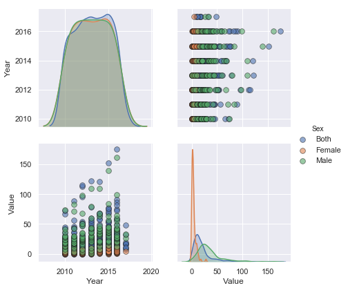

# Exploring Major Cities Health Indicator Data

This notebook focus on analysing big cities health indicator data and plot important indicators and changes in different perespective using python language and other data processing and vusualization tolls such as pandas, seaborn, matlibplot, and soon.

# Data Description

Data link: <a href='https://bchi.bigcitieshealth.org/indicators/1892/searches/34448'> Big Cities Health Data Platform</a>

This dataset illustrates health status of 30 of the nation’s largest and most urban cities as captured with diffirent health indicators. These indicators represent some of the leading causes of morbidity and mortality in the United States and leading priorities of national, state, and local health agencies. Public health data were captured in nine overarching categories: HIV/AIDS, cancer, nutrition/physical activity/obesity, food safety, infectious disease, maternal and child health, tobacco, injury/violence, and behavioral health/substance abuse.


```python
import pandas as pd ## for reading and undestanding data
import matplotlib.pyplot as plt ## for plotting data
import seaborn as sns ## another library to visualize data features
import numpy as np ## for numerical array processing
```


```python
data=pd.read_csv('BCHI-dataset_2019-03-04.csv')#reading csv data to data object with pandas
data.shape ## shows number of rows and columns
```


    (34492, 15)


```python
data.columns ## shows column names as python tuple
```


    Index(['Indicator Category', 'Indicator', 'Year', 'Sex', 'Race/Ethnicity',
           'Value', 'Place', 'BCHC Requested Methodology', 'Source', 'Methods',
           'Notes', '90% Confidence Level - Low', '90% Confidence Level - High',
           '95% Confidence Level - Low', '95% Confidence Level - High'],
          dtype='object')


The data has 34, 492 data points with 15 features (variables to characterize each data points) depicting 'Indicator Category', 'Indicator', 'Year', 'Gender', 'Race/ Ethnicity', 'Value', 'Place', 'BCHC Requested Methodology', 'Source', 'Methods', 'Notes''90% Confidence Level - Low', '90% Confidence Level - High', '95% Confidence Level - Low', and '95% Confidence Level - High' for each data points.

Lets inspect first 5 records from data.


```python
data.head()
```


<div>
<style scoped>
    .dataframe tbody tr th:only-of-type {
        vertical-align: middle;
    }

    .dataframe tbody tr th {
        vertical-align: top;
    }

    .dataframe thead th {
        text-align: right;
    }
</style>
<table border="1" class="dataframe">
  <thead>
    <tr style="text-align: right;">
      <th></th>
      <th>Indicator Category</th>
      <th>Indicator</th>
      <th>Year</th>
      <th>Sex</th>
      <th>Race/Ethnicity</th>
      <th>Value</th>
      <th>Place</th>
      <th>BCHC Requested Methodology</th>
      <th>Source</th>
      <th>Methods</th>
      <th>Notes</th>
      <th>90% Confidence Level - Low</th>
      <th>90% Confidence Level - High</th>
      <th>95% Confidence Level - Low</th>
      <th>95% Confidence Level - High</th>
    </tr>
  </thead>
  <tbody>
    <tr>
      <th>0</th>
      <td>Behavioral Health/Substance Abuse</td>
      <td>Opioid-Related Unintentional Drug Overdose Mor...</td>
      <td>2010</td>
      <td>Both</td>
      <td>All</td>
      <td>1.7</td>
      <td>Washington, DC</td>
      <td>Age-Adjusted rate of opioid-related mortality ...</td>
      <td>D.C. Department of Health, Center for Policy, ...</td>
      <td>NaN</td>
      <td>This indicator is not exclusive of other drugs...</td>
      <td>NaN</td>
      <td>NaN</td>
      <td>NaN</td>
      <td>NaN</td>
    </tr>
    <tr>
      <th>1</th>
      <td>Behavioral Health/Substance Abuse</td>
      <td>Opioid-Related Unintentional Drug Overdose Mor...</td>
      <td>2010</td>
      <td>Both</td>
      <td>All</td>
      <td>2.2</td>
      <td>Fort Worth (Tarrant County), TX</td>
      <td>Age-adjusted rate of opioid-related mortality ...</td>
      <td>National Center for Health Statistics</td>
      <td>NaN</td>
      <td>This indicator is not exclusive of other drugs...</td>
      <td>NaN</td>
      <td>NaN</td>
      <td>1.5</td>
      <td>3.0</td>
    </tr>
    <tr>
      <th>2</th>
      <td>Behavioral Health/Substance Abuse</td>
      <td>Opioid-Related Unintentional Drug Overdose Mor...</td>
      <td>2010</td>
      <td>Both</td>
      <td>All</td>
      <td>2.3</td>
      <td>Oakland (Alameda County), CA</td>
      <td>Age-adjusted rate of opioid-related mortality ...</td>
      <td>CDC Wonder</td>
      <td>Age-adjusted rate of opioid-related mortality ...</td>
      <td>Data is for Alameda County. This indicator is ...</td>
      <td>NaN</td>
      <td>NaN</td>
      <td>1.6</td>
      <td>3.2</td>
    </tr>
    <tr>
      <th>3</th>
      <td>Behavioral Health/Substance Abuse</td>
      <td>Opioid-Related Unintentional Drug Overdose Mor...</td>
      <td>2010</td>
      <td>Both</td>
      <td>All</td>
      <td>3.0</td>
      <td>San Antonio, TX</td>
      <td>Age-adjusted rate of opioid-related mortality ...</td>
      <td>CDC Wonder</td>
      <td>NaN</td>
      <td>This indicator is not exclusive of other drugs...</td>
      <td>NaN</td>
      <td>NaN</td>
      <td>2.2</td>
      <td>3.9</td>
    </tr>
    <tr>
      <th>4</th>
      <td>Behavioral Health/Substance Abuse</td>
      <td>Opioid-Related Unintentional Drug Overdose Mor...</td>
      <td>2010</td>
      <td>Both</td>
      <td>All</td>
      <td>4.4</td>
      <td>U.S. Total, U.S. Total</td>
      <td>Age-Adjusted rate of opioid-related mortality ...</td>
      <td>CDC WONDER</td>
      <td>NaN</td>
      <td>This indicator is not exclusive of other drugs...</td>
      <td>NaN</td>
      <td>NaN</td>
      <td>4.4</td>
      <td>4.5</td>
    </tr>
  </tbody>
</table>
</div>


Variables such as 'BCHC Requested Methodology', 'Source', 'Methods', 'Notes', and confidence level are not important for our analysis, because those variables are included to describe data collection methodology, source of the data, and level for rate defined. Lets drop those variables and inspect the rest


```python
varibles_to_drop = ['BCHC Requested Methodology', 'Source', 'Methods', 'Notes','90% Confidence Level - Low', '90% Confidence Level - High',
       '95% Confidence Level - Low', '95% Confidence Level - High'] # taking all features to be droped as python List object
data=data.drop(varibles_to_drop, axis=1)## drops column cells
data.head() ## displays the fisrt 5 records
```


<div>
<style scoped>
    .dataframe tbody tr th:only-of-type {
        vertical-align: middle;
    }

    .dataframe tbody tr th {
        vertical-align: top;
    }

    .dataframe thead th {
        text-align: right;
    }
</style>
<table border="1" class="dataframe">
  <thead>
    <tr style="text-align: right;">
      <th></th>
      <th>Indicator Category</th>
      <th>Indicator</th>
      <th>Year</th>
      <th>Sex</th>
      <th>Race/Ethnicity</th>
      <th>Value</th>
      <th>Place</th>
    </tr>
  </thead>
  <tbody>
    <tr>
      <th>0</th>
      <td>Behavioral Health/Substance Abuse</td>
      <td>Opioid-Related Unintentional Drug Overdose Mor...</td>
      <td>2010</td>
      <td>Both</td>
      <td>All</td>
      <td>1.7</td>
      <td>Washington, DC</td>
    </tr>
    <tr>
      <th>1</th>
      <td>Behavioral Health/Substance Abuse</td>
      <td>Opioid-Related Unintentional Drug Overdose Mor...</td>
      <td>2010</td>
      <td>Both</td>
      <td>All</td>
      <td>2.2</td>
      <td>Fort Worth (Tarrant County), TX</td>
    </tr>
    <tr>
      <th>2</th>
      <td>Behavioral Health/Substance Abuse</td>
      <td>Opioid-Related Unintentional Drug Overdose Mor...</td>
      <td>2010</td>
      <td>Both</td>
      <td>All</td>
      <td>2.3</td>
      <td>Oakland (Alameda County), CA</td>
    </tr>
    <tr>
      <th>3</th>
      <td>Behavioral Health/Substance Abuse</td>
      <td>Opioid-Related Unintentional Drug Overdose Mor...</td>
      <td>2010</td>
      <td>Both</td>
      <td>All</td>
      <td>3.0</td>
      <td>San Antonio, TX</td>
    </tr>
    <tr>
      <th>4</th>
      <td>Behavioral Health/Substance Abuse</td>
      <td>Opioid-Related Unintentional Drug Overdose Mor...</td>
      <td>2010</td>
      <td>Both</td>
      <td>All</td>
      <td>4.4</td>
      <td>U.S. Total, U.S. Total</td>
    </tr>
  </tbody>
</table>
</div>


```python
data=data[(data['Indicator Category']=='Behavioral Health/Substance Abuse')]

_=sns.pairplot(data, hue = 'Place', diag_kind = 'kde', plot_kws = {'alpha': 0.6, 's': 80, 'edgecolor': 'k'}, height = 4);
```


```python
data[(data['Indicator Category']=='HIV/AIDS')].head()
```


<div>
<style scoped>
    .dataframe tbody tr th:only-of-type {
        vertical-align: middle;
    }

    .dataframe tbody tr th {
        vertical-align: top;
    }

    .dataframe thead th {
        text-align: right;
    }
</style>
<table border="1" class="dataframe">
  <thead>
    <tr style="text-align: right;">
      <th></th>
      <th>Indicator Category</th>
      <th>Indicator</th>
      <th>Year</th>
      <th>Gender</th>
      <th>Race/ Ethnicity</th>
      <th>Value</th>
      <th>Place</th>
      <th>BCHC Requested Methodology</th>
      <th>Source</th>
      <th>Methods</th>
      <th>Notes</th>
    </tr>
  </thead>
  <tbody>
    <tr>
      <th>0</th>
      <td>HIV/AIDS</td>
      <td>AIDS Diagnoses Rate (Per 100,000 people)</td>
      <td>2013</td>
      <td>Both</td>
      <td>All</td>
      <td>30.4</td>
      <td>Atlanta (Fulton County), GA</td>
      <td>AIDS cases diagnosed in 2012, 2013, 2014 (as a...</td>
      <td>Diagnoses numbers were obtained from the Georg...</td>
      <td>NaN</td>
      <td>NaN</td>
    </tr>
    <tr>
      <th>1</th>
      <td>HIV/AIDS</td>
      <td>AIDS Diagnoses Rate (Per 100,000 people)</td>
      <td>2012</td>
      <td>Both</td>
      <td>All</td>
      <td>39.6</td>
      <td>Atlanta (Fulton County), GA</td>
      <td>AIDS cases diagnosed in 2012, 2013, 2014 (as a...</td>
      <td>Diagnoses numbers were obtained from the Georg...</td>
      <td>NaN</td>
      <td>NaN</td>
    </tr>
    <tr>
      <th>2</th>
      <td>HIV/AIDS</td>
      <td>AIDS Diagnoses Rate (Per 100,000 people)</td>
      <td>2011</td>
      <td>Both</td>
      <td>All</td>
      <td>41.7</td>
      <td>Atlanta (Fulton County), GA</td>
      <td>AIDS cases diagnosed in 2012, 2013, 2014 (as a...</td>
      <td>Diagnoses numbers were obtained from the Georg...</td>
      <td>NaN</td>
      <td>NaN</td>
    </tr>
    <tr>
      <th>94</th>
      <td>HIV/AIDS</td>
      <td>HIV Diagnoses Rate (Per 100,000 people)</td>
      <td>2012</td>
      <td>Male</td>
      <td>All</td>
      <td>131.2</td>
      <td>Atlanta (Fulton County), GA</td>
      <td>HIV cases diagnosed in 2012, 2013, 20014 (as a...</td>
      <td>Diagnoses numbers were obtained from the Georg...</td>
      <td>NaN</td>
      <td>NaN</td>
    </tr>
    <tr>
      <th>95</th>
      <td>HIV/AIDS</td>
      <td>HIV Diagnoses Rate (Per 100,000 people)</td>
      <td>2012</td>
      <td>Female</td>
      <td>All</td>
      <td>18.8</td>
      <td>Atlanta (Fulton County), GA</td>
      <td>HIV cases diagnosed in 2012, 2013, 20014 (as a...</td>
      <td>Diagnoses numbers were obtained from the Georg...</td>
      <td>NaN</td>
      <td>NaN</td>
    </tr>
  </tbody>
</table>
</div>


```python
d=data[(data['Indicator Category']=='Behavioral Health/Substance Abuse')]
d.head()
```


<div>
<style scoped>
    .dataframe tbody tr th:only-of-type {
        vertical-align: middle;
    }

    .dataframe tbody tr th {
        vertical-align: top;
    }

    .dataframe thead th {
        text-align: right;
    }
</style>
<table border="1" class="dataframe">
  <thead>
    <tr style="text-align: right;">
      <th></th>
      <th>Indicator Category</th>
      <th>Indicator</th>
      <th>Year</th>
      <th>Sex</th>
      <th>Race/Ethnicity</th>
      <th>Value</th>
      <th>Place</th>
    </tr>
  </thead>
  <tbody>
    <tr>
      <th>0</th>
      <td>Behavioral Health/Substance Abuse</td>
      <td>Opioid-Related Unintentional Drug Overdose Mor...</td>
      <td>2010</td>
      <td>Both</td>
      <td>All</td>
      <td>1.7</td>
      <td>Washington, DC</td>
    </tr>
    <tr>
      <th>1</th>
      <td>Behavioral Health/Substance Abuse</td>
      <td>Opioid-Related Unintentional Drug Overdose Mor...</td>
      <td>2010</td>
      <td>Both</td>
      <td>All</td>
      <td>2.2</td>
      <td>Fort Worth (Tarrant County), TX</td>
    </tr>
    <tr>
      <th>2</th>
      <td>Behavioral Health/Substance Abuse</td>
      <td>Opioid-Related Unintentional Drug Overdose Mor...</td>
      <td>2010</td>
      <td>Both</td>
      <td>All</td>
      <td>2.3</td>
      <td>Oakland (Alameda County), CA</td>
    </tr>
    <tr>
      <th>3</th>
      <td>Behavioral Health/Substance Abuse</td>
      <td>Opioid-Related Unintentional Drug Overdose Mor...</td>
      <td>2010</td>
      <td>Both</td>
      <td>All</td>
      <td>3.0</td>
      <td>San Antonio, TX</td>
    </tr>
    <tr>
      <th>4</th>
      <td>Behavioral Health/Substance Abuse</td>
      <td>Opioid-Related Unintentional Drug Overdose Mor...</td>
      <td>2010</td>
      <td>Both</td>
      <td>All</td>
      <td>4.4</td>
      <td>U.S. Total, U.S. Total</td>
    </tr>
  </tbody>
</table>
</div>


```python
d[(d['Indicator']=='Percent of High School Students Who Binge Drank')]
```


<div>
<style scoped>
    .dataframe tbody tr th:only-of-type {
        vertical-align: middle;
    }

    .dataframe tbody tr th {
        vertical-align: top;
    }

    .dataframe thead th {
        text-align: right;
    }
</style>
<table border="1" class="dataframe">
  <thead>
    <tr style="text-align: right;">
      <th></th>
      <th>Indicator Category</th>
      <th>Indicator</th>
      <th>Year</th>
      <th>Sex</th>
      <th>Race/Ethnicity</th>
      <th>Value</th>
      <th>Place</th>
    </tr>
  </thead>
  <tbody>
    <tr>
      <th>1167</th>
      <td>Behavioral Health/Substance Abuse</td>
      <td>Percent of High School Students Who Binge Drank</td>
      <td>2010</td>
      <td>Both</td>
      <td>All</td>
      <td>19.0</td>
      <td>Seattle, WA</td>
    </tr>
    <tr>
      <th>1168</th>
      <td>Behavioral Health/Substance Abuse</td>
      <td>Percent of High School Students Who Binge Drank</td>
      <td>2010</td>
      <td>Both</td>
      <td>All</td>
      <td>19.7</td>
      <td>Chicago, Il</td>
    </tr>
    <tr>
      <th>1169</th>
      <td>Behavioral Health/Substance Abuse</td>
      <td>Percent of High School Students Who Binge Drank</td>
      <td>2010</td>
      <td>Both</td>
      <td>Asian/PI</td>
      <td>12.0</td>
      <td>Seattle, WA</td>
    </tr>
    <tr>
      <th>1170</th>
      <td>Behavioral Health/Substance Abuse</td>
      <td>Percent of High School Students Who Binge Drank</td>
      <td>2010</td>
      <td>Both</td>
      <td>Black</td>
      <td>13.0</td>
      <td>Seattle, WA</td>
    </tr>
    <tr>
      <th>1171</th>
      <td>Behavioral Health/Substance Abuse</td>
      <td>Percent of High School Students Who Binge Drank</td>
      <td>2010</td>
      <td>Both</td>
      <td>Black</td>
      <td>13.4</td>
      <td>Chicago, Il</td>
    </tr>
    <tr>
      <th>1172</th>
      <td>Behavioral Health/Substance Abuse</td>
      <td>Percent of High School Students Who Binge Drank</td>
      <td>2010</td>
      <td>Both</td>
      <td>Hispanic</td>
      <td>21.0</td>
      <td>Seattle, WA</td>
    </tr>
    <tr>
      <th>1173</th>
      <td>Behavioral Health/Substance Abuse</td>
      <td>Percent of High School Students Who Binge Drank</td>
      <td>2010</td>
      <td>Both</td>
      <td>Hispanic</td>
      <td>25.8</td>
      <td>Chicago, Il</td>
    </tr>
    <tr>
      <th>1174</th>
      <td>Behavioral Health/Substance Abuse</td>
      <td>Percent of High School Students Who Binge Drank</td>
      <td>2010</td>
      <td>Both</td>
      <td>Other</td>
      <td>19.0</td>
      <td>Seattle, WA</td>
    </tr>
    <tr>
      <th>1175</th>
      <td>Behavioral Health/Substance Abuse</td>
      <td>Percent of High School Students Who Binge Drank</td>
      <td>2010</td>
      <td>Both</td>
      <td>White</td>
      <td>23.0</td>
      <td>Seattle, WA</td>
    </tr>
    <tr>
      <th>1176</th>
      <td>Behavioral Health/Substance Abuse</td>
      <td>Percent of High School Students Who Binge Drank</td>
      <td>2010</td>
      <td>Female</td>
      <td>All</td>
      <td>18.9</td>
      <td>Chicago, Il</td>
    </tr>
    <tr>
      <th>1177</th>
      <td>Behavioral Health/Substance Abuse</td>
      <td>Percent of High School Students Who Binge Drank</td>
      <td>2010</td>
      <td>Male</td>
      <td>All</td>
      <td>20.0</td>
      <td>Seattle, WA</td>
    </tr>
    <tr>
      <th>1178</th>
      <td>Behavioral Health/Substance Abuse</td>
      <td>Percent of High School Students Who Binge Drank</td>
      <td>2011</td>
      <td>Both</td>
      <td>All</td>
      <td>7.7</td>
      <td>Los Angeles, CA</td>
    </tr>
    <tr>
      <th>1179</th>
      <td>Behavioral Health/Substance Abuse</td>
      <td>Percent of High School Students Who Binge Drank</td>
      <td>2011</td>
      <td>Both</td>
      <td>All</td>
      <td>7.9</td>
      <td>U.S. Total, U.S. Total</td>
    </tr>
    <tr>
      <th>1180</th>
      <td>Behavioral Health/Substance Abuse</td>
      <td>Percent of High School Students Who Binge Drank</td>
      <td>2011</td>
      <td>Both</td>
      <td>All</td>
      <td>8.2</td>
      <td>Detroit, MI</td>
    </tr>
    <tr>
      <th>1181</th>
      <td>Behavioral Health/Substance Abuse</td>
      <td>Percent of High School Students Who Binge Drank</td>
      <td>2011</td>
      <td>Both</td>
      <td>All</td>
      <td>11.7</td>
      <td>San Francisco, CA</td>
    </tr>
    <tr>
      <th>1182</th>
      <td>Behavioral Health/Substance Abuse</td>
      <td>Percent of High School Students Who Binge Drank</td>
      <td>2011</td>
      <td>Both</td>
      <td>All</td>
      <td>12.7</td>
      <td>New York City, NY</td>
    </tr>
    <tr>
      <th>1183</th>
      <td>Behavioral Health/Substance Abuse</td>
      <td>Percent of High School Students Who Binge Drank</td>
      <td>2011</td>
      <td>Both</td>
      <td>All</td>
      <td>15.2</td>
      <td>Philadelphia, PA</td>
    </tr>
    <tr>
      <th>1184</th>
      <td>Behavioral Health/Substance Abuse</td>
      <td>Percent of High School Students Who Binge Drank</td>
      <td>2011</td>
      <td>Both</td>
      <td>All</td>
      <td>15.6</td>
      <td>Charlotte, NC</td>
    </tr>
    <tr>
      <th>1185</th>
      <td>Behavioral Health/Substance Abuse</td>
      <td>Percent of High School Students Who Binge Drank</td>
      <td>2011</td>
      <td>Both</td>
      <td>All</td>
      <td>16.6</td>
      <td>Boston, MA</td>
    </tr>
    <tr>
      <th>1186</th>
      <td>Behavioral Health/Substance Abuse</td>
      <td>Percent of High School Students Who Binge Drank</td>
      <td>2011</td>
      <td>Both</td>
      <td>All</td>
      <td>17.5</td>
      <td>Miami (Miami-Dade County), FL</td>
    </tr>
    <tr>
      <th>1187</th>
      <td>Behavioral Health/Substance Abuse</td>
      <td>Percent of High School Students Who Binge Drank</td>
      <td>2011</td>
      <td>Both</td>
      <td>All</td>
      <td>33.0</td>
      <td>Houston, TX</td>
    </tr>
    <tr>
      <th>1188</th>
      <td>Behavioral Health/Substance Abuse</td>
      <td>Percent of High School Students Who Binge Drank</td>
      <td>2011</td>
      <td>Both</td>
      <td>American Indian/Alaska Native</td>
      <td>9.6</td>
      <td>U.S. Total, U.S. Total</td>
    </tr>
    <tr>
      <th>1189</th>
      <td>Behavioral Health/Substance Abuse</td>
      <td>Percent of High School Students Who Binge Drank</td>
      <td>2011</td>
      <td>Both</td>
      <td>American Indian/Alaska Native</td>
      <td>15.8</td>
      <td>San Diego County, CA</td>
    </tr>
    <tr>
      <th>1190</th>
      <td>Behavioral Health/Substance Abuse</td>
      <td>Percent of High School Students Who Binge Drank</td>
      <td>2011</td>
      <td>Both</td>
      <td>Asian/PI</td>
      <td>4.1</td>
      <td>U.S. Total, U.S. Total</td>
    </tr>
    <tr>
      <th>1191</th>
      <td>Behavioral Health/Substance Abuse</td>
      <td>Percent of High School Students Who Binge Drank</td>
      <td>2011</td>
      <td>Both</td>
      <td>Asian/PI</td>
      <td>4.2</td>
      <td>San Diego County, CA</td>
    </tr>
    <tr>
      <th>1192</th>
      <td>Behavioral Health/Substance Abuse</td>
      <td>Percent of High School Students Who Binge Drank</td>
      <td>2011</td>
      <td>Both</td>
      <td>Asian/PI</td>
      <td>5.0</td>
      <td>New York City, NY</td>
    </tr>
    <tr>
      <th>1193</th>
      <td>Behavioral Health/Substance Abuse</td>
      <td>Percent of High School Students Who Binge Drank</td>
      <td>2011</td>
      <td>Both</td>
      <td>Asian/PI</td>
      <td>5.5</td>
      <td>San Francisco, CA</td>
    </tr>
    <tr>
      <th>1194</th>
      <td>Behavioral Health/Substance Abuse</td>
      <td>Percent of High School Students Who Binge Drank</td>
      <td>2011</td>
      <td>Both</td>
      <td>Asian/PI</td>
      <td>7.5</td>
      <td>Philadelphia, PA</td>
    </tr>
    <tr>
      <th>1195</th>
      <td>Behavioral Health/Substance Abuse</td>
      <td>Percent of High School Students Who Binge Drank</td>
      <td>2011</td>
      <td>Both</td>
      <td>Asian/PI</td>
      <td>15.2</td>
      <td>Boston, MA</td>
    </tr>
    <tr>
      <th>1196</th>
      <td>Behavioral Health/Substance Abuse</td>
      <td>Percent of High School Students Who Binge Drank</td>
      <td>2011</td>
      <td>Both</td>
      <td>Black</td>
      <td>4.6</td>
      <td>U.S. Total, U.S. Total</td>
    </tr>
    <tr>
      <th>...</th>
      <td>...</td>
      <td>...</td>
      <td>...</td>
      <td>...</td>
      <td>...</td>
      <td>...</td>
      <td>...</td>
    </tr>
    <tr>
      <th>1435</th>
      <td>Behavioral Health/Substance Abuse</td>
      <td>Percent of High School Students Who Binge Drank</td>
      <td>2015</td>
      <td>Both</td>
      <td>White</td>
      <td>15.8</td>
      <td>Las Vegas (Clark County), NV</td>
    </tr>
    <tr>
      <th>1436</th>
      <td>Behavioral Health/Substance Abuse</td>
      <td>Percent of High School Students Who Binge Drank</td>
      <td>2015</td>
      <td>Both</td>
      <td>White</td>
      <td>16.0</td>
      <td>Miami (Miami-Dade County), FL</td>
    </tr>
    <tr>
      <th>1437</th>
      <td>Behavioral Health/Substance Abuse</td>
      <td>Percent of High School Students Who Binge Drank</td>
      <td>2015</td>
      <td>Both</td>
      <td>White</td>
      <td>17.2</td>
      <td>Philadelphia, PA</td>
    </tr>
    <tr>
      <th>1438</th>
      <td>Behavioral Health/Substance Abuse</td>
      <td>Percent of High School Students Who Binge Drank</td>
      <td>2015</td>
      <td>Both</td>
      <td>White</td>
      <td>18.7</td>
      <td>Fort Worth (Tarrant County), TX</td>
    </tr>
    <tr>
      <th>1439</th>
      <td>Behavioral Health/Substance Abuse</td>
      <td>Percent of High School Students Who Binge Drank</td>
      <td>2015</td>
      <td>Both</td>
      <td>White</td>
      <td>19.7</td>
      <td>U.S. Total, U.S. Total</td>
    </tr>
    <tr>
      <th>1440</th>
      <td>Behavioral Health/Substance Abuse</td>
      <td>Percent of High School Students Who Binge Drank</td>
      <td>2015</td>
      <td>Both</td>
      <td>White</td>
      <td>22.5</td>
      <td>Boston, MA</td>
    </tr>
    <tr>
      <th>1441</th>
      <td>Behavioral Health/Substance Abuse</td>
      <td>Percent of High School Students Who Binge Drank</td>
      <td>2015</td>
      <td>Both</td>
      <td>White</td>
      <td>24.5</td>
      <td>Charlotte, NC</td>
    </tr>
    <tr>
      <th>1442</th>
      <td>Behavioral Health/Substance Abuse</td>
      <td>Percent of High School Students Who Binge Drank</td>
      <td>2015</td>
      <td>Both</td>
      <td>White</td>
      <td>28.3</td>
      <td>San Francisco, CA</td>
    </tr>
    <tr>
      <th>1443</th>
      <td>Behavioral Health/Substance Abuse</td>
      <td>Percent of High School Students Who Binge Drank</td>
      <td>2015</td>
      <td>Female</td>
      <td>All</td>
      <td>9.1</td>
      <td>New York City, NY</td>
    </tr>
    <tr>
      <th>1444</th>
      <td>Behavioral Health/Substance Abuse</td>
      <td>Percent of High School Students Who Binge Drank</td>
      <td>2015</td>
      <td>Female</td>
      <td>All</td>
      <td>9.7</td>
      <td>Detroit, MI</td>
    </tr>
    <tr>
      <th>1445</th>
      <td>Behavioral Health/Substance Abuse</td>
      <td>Percent of High School Students Who Binge Drank</td>
      <td>2015</td>
      <td>Female</td>
      <td>All</td>
      <td>9.7</td>
      <td>San Francisco, CA</td>
    </tr>
    <tr>
      <th>1446</th>
      <td>Behavioral Health/Substance Abuse</td>
      <td>Percent of High School Students Who Binge Drank</td>
      <td>2015</td>
      <td>Female</td>
      <td>All</td>
      <td>10.7</td>
      <td>Philadelphia, PA</td>
    </tr>
    <tr>
      <th>1447</th>
      <td>Behavioral Health/Substance Abuse</td>
      <td>Percent of High School Students Who Binge Drank</td>
      <td>2015</td>
      <td>Female</td>
      <td>All</td>
      <td>11.1</td>
      <td>Boston, MA</td>
    </tr>
    <tr>
      <th>1448</th>
      <td>Behavioral Health/Substance Abuse</td>
      <td>Percent of High School Students Who Binge Drank</td>
      <td>2015</td>
      <td>Female</td>
      <td>All</td>
      <td>13.9</td>
      <td>Charlotte, NC</td>
    </tr>
    <tr>
      <th>1449</th>
      <td>Behavioral Health/Substance Abuse</td>
      <td>Percent of High School Students Who Binge Drank</td>
      <td>2015</td>
      <td>Female</td>
      <td>All</td>
      <td>14.1</td>
      <td>Fort Worth (Tarrant County), TX</td>
    </tr>
    <tr>
      <th>1450</th>
      <td>Behavioral Health/Substance Abuse</td>
      <td>Percent of High School Students Who Binge Drank</td>
      <td>2015</td>
      <td>Female</td>
      <td>All</td>
      <td>14.3</td>
      <td>Portland (Multnomah County), OR</td>
    </tr>
    <tr>
      <th>1451</th>
      <td>Behavioral Health/Substance Abuse</td>
      <td>Percent of High School Students Who Binge Drank</td>
      <td>2015</td>
      <td>Female</td>
      <td>All</td>
      <td>15.7</td>
      <td>Miami (Miami-Dade County), FL</td>
    </tr>
    <tr>
      <th>1452</th>
      <td>Behavioral Health/Substance Abuse</td>
      <td>Percent of High School Students Who Binge Drank</td>
      <td>2015</td>
      <td>Female</td>
      <td>All</td>
      <td>16.6</td>
      <td>Las Vegas (Clark County), NV</td>
    </tr>
    <tr>
      <th>1453</th>
      <td>Behavioral Health/Substance Abuse</td>
      <td>Percent of High School Students Who Binge Drank</td>
      <td>2015</td>
      <td>Female</td>
      <td>All</td>
      <td>16.8</td>
      <td>U.S. Total, U.S. Total</td>
    </tr>
    <tr>
      <th>1454</th>
      <td>Behavioral Health/Substance Abuse</td>
      <td>Percent of High School Students Who Binge Drank</td>
      <td>2015</td>
      <td>Male</td>
      <td>All</td>
      <td>7.8</td>
      <td>New York City, NY</td>
    </tr>
    <tr>
      <th>1455</th>
      <td>Behavioral Health/Substance Abuse</td>
      <td>Percent of High School Students Who Binge Drank</td>
      <td>2015</td>
      <td>Male</td>
      <td>All</td>
      <td>7.9</td>
      <td>Detroit, MI</td>
    </tr>
    <tr>
      <th>1456</th>
      <td>Behavioral Health/Substance Abuse</td>
      <td>Percent of High School Students Who Binge Drank</td>
      <td>2015</td>
      <td>Male</td>
      <td>All</td>
      <td>8.1</td>
      <td>San Francisco, CA</td>
    </tr>
    <tr>
      <th>1457</th>
      <td>Behavioral Health/Substance Abuse</td>
      <td>Percent of High School Students Who Binge Drank</td>
      <td>2015</td>
      <td>Male</td>
      <td>All</td>
      <td>10.8</td>
      <td>Boston, MA</td>
    </tr>
    <tr>
      <th>1458</th>
      <td>Behavioral Health/Substance Abuse</td>
      <td>Percent of High School Students Who Binge Drank</td>
      <td>2015</td>
      <td>Male</td>
      <td>All</td>
      <td>10.8</td>
      <td>Philadelphia, PA</td>
    </tr>
    <tr>
      <th>1459</th>
      <td>Behavioral Health/Substance Abuse</td>
      <td>Percent of High School Students Who Binge Drank</td>
      <td>2015</td>
      <td>Male</td>
      <td>All</td>
      <td>11.6</td>
      <td>Las Vegas (Clark County), NV</td>
    </tr>
    <tr>
      <th>1460</th>
      <td>Behavioral Health/Substance Abuse</td>
      <td>Percent of High School Students Who Binge Drank</td>
      <td>2015</td>
      <td>Male</td>
      <td>All</td>
      <td>14.6</td>
      <td>Fort Worth (Tarrant County), TX</td>
    </tr>
    <tr>
      <th>1461</th>
      <td>Behavioral Health/Substance Abuse</td>
      <td>Percent of High School Students Who Binge Drank</td>
      <td>2015</td>
      <td>Male</td>
      <td>All</td>
      <td>15.6</td>
      <td>Portland (Multnomah County), OR</td>
    </tr>
    <tr>
      <th>1462</th>
      <td>Behavioral Health/Substance Abuse</td>
      <td>Percent of High School Students Who Binge Drank</td>
      <td>2015</td>
      <td>Male</td>
      <td>All</td>
      <td>15.9</td>
      <td>Charlotte, NC</td>
    </tr>
    <tr>
      <th>1463</th>
      <td>Behavioral Health/Substance Abuse</td>
      <td>Percent of High School Students Who Binge Drank</td>
      <td>2015</td>
      <td>Male</td>
      <td>All</td>
      <td>16.4</td>
      <td>Miami (Miami-Dade County), FL</td>
    </tr>
    <tr>
      <th>1464</th>
      <td>Behavioral Health/Substance Abuse</td>
      <td>Percent of High School Students Who Binge Drank</td>
      <td>2015</td>
      <td>Male</td>
      <td>All</td>
      <td>18.6</td>
      <td>U.S. Total, U.S. Total</td>
    </tr>
  </tbody>
</table>
<p>298 rows × 7 columns</p>
</div>


```python
def plot_indicator_per_cities(category,data_count):
    fig, ax = plt.subplots(figsize=(10, 3))
    ax.tick_params(axis='x', labelsize=15)
    ax.tick_params(axis='y', labelsize=10)
    ax.set_xlabel('Cities', fontsize=15)
    ax.set_ylabel('Category count' , fontsize=15)
    ax.set_title('Distribution of {} over different cities'.format(category), fontsize=15, fontweight='bold')
    _=place_count.plot(ax=ax, kind='bar')
```


```python
from datetime import datetime
dt=str(2010)
dd=datetime.strptime(dt,'%Y')
```


```python
data_sub=data.copy()
data_substance=data[(data['Indicator Category']=='Behavioral Health/Substance Abuse')]
data_sex=data[(data['Indicator Category']=='Sexually Transmitted Infections')]
data_cancer=data[(data['Indicator Category']=='Cancer')]
```


```python
## all cancer, lung cancer, breast cancer mortality rate
## yearly brest cancer mortality rate accross all countries
## country wide for selected countries
place_count=data_substance['Place'].value_counts() 
plot_indicator_per_cities('Behavioral Health/Substance Abuse',place_count)

```


```python
# all_cancer=data_cancer[(data_cancer['Indicator']=='All Types of Cancer Mortality Rate (Age-Adjusted; Per 100,000 people)')]
all_cancer=data_cancer[['Year','Value']]
all_cancer = all_cancer.dropna(how='any',axis=0)
cancer_by_year=all_cancer.groupby('Year')['Value'].sum()
fig, ax = plt.subplots(figsize=(5, 3))
plt.title('Yearly cancer mortality rate over all cities')
plt.ylabel('Total mortality rate per year')
plt.xlabel('Years')
ax.tick_params(axis='x', labelsize=15)
ax.tick_params(axis='y', labelsize=10)
ax.set_xlabel('Years', fontsize=15)
ax.set_ylabel('Total mortality rate per year' , fontsize=15)
ax.set_title('Yearly cancer mortality rate over all cities', fontsize=15, fontweight='bold')
_=cancer_by_year.plot(kind='line')
# plt.show()
```


```python
# all_cancer=data_cancer[(data_cancer['Indicator']=='Lung Cancer Mortality Rate (Age-Adjusted; Per 100,000 people)') & (data_cancer['Place']=='Boston, MA')]
all_cancer=data_cancer[['Place','Value']]
all_cancer = all_cancer.dropna(how='any',axis=0)
cancer_boston=all_cancer.groupby('Place')['Value'].sum()
fig, ax = plt.subplots(figsize=(10, 3))
ax.tick_params(axis='x', labelsize=10)
ax.tick_params(axis='y', labelsize=10)
ax.set_xlabel('Cities', fontsize=10)
ax.set_ylabel('Mortality rate' , fontsize=10)
ax.set_title('Total cancer mortality rate between (2010-2016)', fontsize=15, fontweight='bold')
_=cancer_boston.plot(kind='bar')
```


```python
lung_cancer=data_cancer[(data_cancer['Indicator']=='Lung Cancer Mortality Rate (Age-Adjusted; Per 100,000 people)')]
#& (data_cancer['Place']=='Boston, MA')
lung_cancer=lung_cancer[['Place','Value']]
lung_cancer = lung_cancer.dropna(how='any',axis=0)
lung_cancer=lung_cancer.groupby('Place')['Value'].sum()
fig, ax = plt.subplots(figsize=(10, 3))
ax.tick_params(axis='x', labelsize=12)
ax.tick_params(axis='y', labelsize=12)
ax.set_xlabel('Cities', fontsize=12)
ax.set_ylabel('Lung Cancer Mortality rate' , fontsize=12)
ax.set_title('Total Lung Cancer mortality rate between (2010-2016)', fontsize=15, fontweight='bold')
_=lung_cancer.plot(kind='bar')
```


```python
def plot_indicators(y_feature,x_feature,data_sub):
    sns.set(rc={'figure.figsize':(10,10)})
    ax=sns.plot(y=y_feature,hue=x_feature,data=data_sub)
    for p in ax.patches:
        patch_height = p.get_height()
        if np.isnan(patch_height):
            patch_height = 0
        ax.annotate('{}'.format(int(patch_height)), (p.get_x()+0.01, patch_height+3))
    plt.title("Distribution of {} per {}".format(y_feature,x_feature))
    plt.show()
```


```python
lung_cancer=data_cancer[(data_cancer['Indicator']=='Lung Cancer Mortality Rate (Age-Adjusted; Per 100,000 people)') & (data_cancer['Sex']=='Female')]
#& (data_cancer['Place']=='Boston, MA')
lung_cancer=lung_cancer[['Place','Value']]
lung_cancer = lung_cancer.dropna(how='any',axis=0)
lung_cancer=lung_cancer.groupby('Place')['Value'].sum()
fig, ax = plt.subplots(figsize=(10, 3))
ax.tick_params(axis='x', labelsize=12)
ax.tick_params(axis='y', labelsize=12)
ax.set_xlabel('Cities', fontsize=12)
ax.set_ylabel('Female Lung Cancer Mortality rate' , fontsize=12)
ax.set_title('Female Lung Cancer mortality rate between (2010-2016)', fontsize=15, fontweight='bold')
_=lung_cancer.plot(kind='bar')
# plot_indicators('Value','Place')
```


```python
all_cancer=data_cancer[(data_cancer['Indicator']=='Lung Cancer Mortality Rate (Age-Adjusted; Per 100,000 people)') & (data_cancer['Place']=='Boston, MA')]
all_cancer=all_cancer[['Year','Value']]
all_cancer = all_cancer.dropna(how='any',axis=0)
cancer_boston=all_cancer.groupby('Year')['Value'].sum()
fig, ax = plt.subplots(figsize=(5, 3))
ax.tick_params(axis='x', labelsize=15)
ax.tick_params(axis='y', labelsize=10)
ax.set_xlabel('Years', fontsize=15)
ax.set_ylabel('spreding mortality rate over year' , fontsize=10)
ax.set_title('Lung-cancer mortality rate of Boston, MA (2010-2016)', fontsize=15, fontweight='bold')
_=cancer_boston.plot(kind='line')
```


```python
sex_infection=data_sex[(data_sex['Indicator']=='Primary and Secondary Syphilis Rate (Per 100,000 People)')]
# sex_infection=sex_infection[['Place','Year','Value']]
_=sns.pairplot(sex_infection, hue = 'Sex', diag_kind = 'kde', vars=['Year','Value'], plot_kws = {'alpha': 0.6, 's': 60, 'edgecolor': 'k'}, height = 3);
```





```python
# place_count=data_sex['Place'].value_counts() 
sex_infection=data_sex[(data_sex['Indicator']=='Primary and Secondary Syphilis Rate (Per 100,000 People)')]
sex_infection=sex_infection[['Place','Value']]
sex_infection = sex_infection.dropna(how='any',axis=0)
sex_infection=sex_infection.groupby('Place')['Value'].sum()
print(sex_infection.head())
fig, ax = plt.subplots(figsize=(8, 2))
ax.tick_params(axis='x', labelsize=15)
ax.tick_params(axis='y', labelsize=10)
ax.set_xlabel('Cities', fontsize=15)
ax.set_ylabel('SpreadingRate' , fontsize=10)
ax.set_title('Primary and Secondary Syphilis Rate (Per 100,000 People)', fontsize=15, fontweight='bold')
_=sex_infection.plot(kind='bar')
```

    Place
    Boston, MA       1712.6
    Charlotte, NC     594.9
    Columbus, OH      608.6
    Dallas, TX        165.0
    Denver, CO        884.0
    Name: Value, dtype: float64
    


```python
Primary and Secondary Syphilis Rate
```


```python
data['Indicator Category'].value_counts() 
```


    Chronic Disease                             4854
    HIV/AIDS                                    3887
    Injury/Violence                             3776
    Demographics                                3397
    Sexually Transmitted Infections             3348
    Infectious Disease                          3082
    Cancer                                      2670
    Social and Economic Factors                 2573
    Maternal and Child Health                   2213
    Food Safety                                 1495
    Behavioral Health/Substance Abuse           1465
    Life Expectancy and Death Rate (Overall)    1424
    Environment                                  308
    Name: Indicator Category, dtype: int64


```python
data['Methods'].value_counts() 
```

From this data we can analyse, 
<ol><li>which countries are commonly attacked by which disease?</li>
    <li>Disease spreading rate per year for most commonly affected countiries.</li>
    <li>Which gender or race is commonly attacked? </li>
    </ol> with aim to give clue for concerned bodies (can be government offical, NGO's or individuals).
